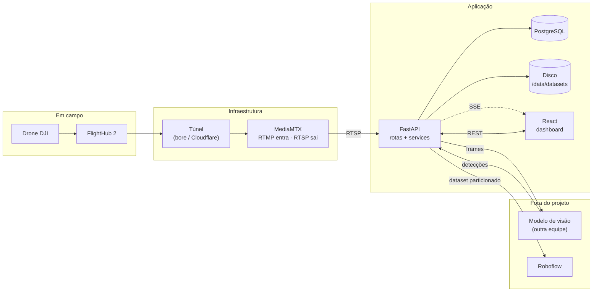
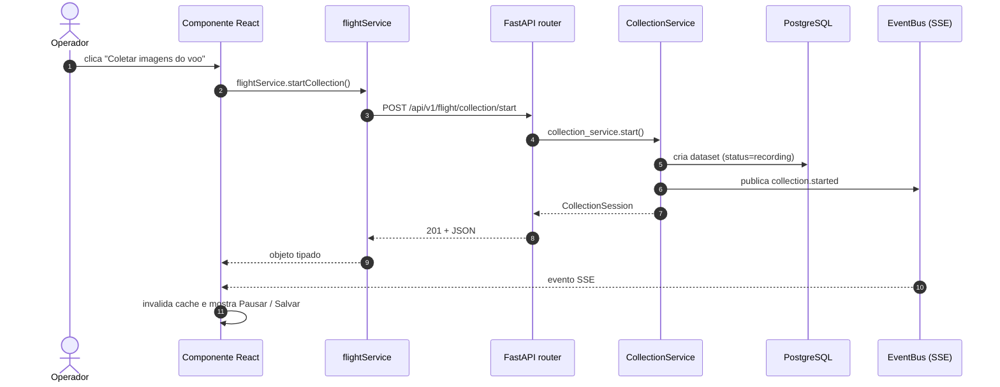

# Arquitetura

## Visão de conjunto



O drone publica no FlightHub, que encaminha para um endereço RTMP. O MediaMTX
recebe e reexpõe como RTSP. O backend consome, grava frames e entrega ao modelo.
O que volta são detecções, que viram inspeções no banco. O React só lê o que a
API expõe.

## As três camadas e o que cada uma pode fazer

| Camada | Responsabilidade | Proibido |
| --- | --- | --- |
| **React** | Renderizar, capturar intenção do usuário, exibir estado | Regra de negócio, `fetch` solto, divisão de dataset, decidir se pode salvar |
| **FastAPI (rotas)** | Validar entrada, chamar um service, devolver schema | Consultar banco, chamar integração, calcular |
| **Services** | Toda a regra de negócio, transação, orquestração | Conhecer HTTP, `Request`, `Response` |
| **Integrations** | Falar com FlightHub, MediaMTX, Roboflow | Regra de negócio |

A regra prática: se uma rota tem mais de cinco linhas, provavelmente há regra
de negócio nela que deveria estar em um service.

## Fluxo de uma ação



Repare que a resposta HTTP **e** o evento SSE chegam ao componente. A resposta
confirma que o comando foi aceito; o evento avisa todos os outros navegadores
abertos. Sem SSE, dois operadores veriam telas diferentes.

## Comunicação React ↔ FastAPI

| Necessidade | Mecanismo | Onde |
| --- | --- | --- |
| Ler dados | REST `GET` + TanStack Query | `hooks/use*.ts` |
| Comandar | REST `POST`/`PUT` + mutation | `hooks/use*.ts` |
| Saber que algo mudou | SSE em `/flight/events` | `hooks/useServerEvents.ts` |
| Rede de segurança | `refetchInterval` folgado (15 s) no status | `useFlightStatus` |

WebSocket foi descartado: o tráfego é de mão única, servidor → cliente, e o
`EventSource` reconecta sozinho sem nenhuma linha de código. Ver
[ADR 002](decisions/002-realtime-sse.md).

## Estrutura de diretórios

```text
fly_hub_system/
├── backend/
│   ├── app/
│   │   ├── api/v1/routes/       # uma rota por domínio, só orquestração
│   │   ├── core/                # config, logging, erros, event bus
│   │   ├── db/                  # sessão, seed
│   │   ├── models/              # tabelas SQLAlchemy
│   │   ├── schemas/             # contratos Pydantic de entrada e saída
│   │   ├── services/            # regra de negócio
│   │   ├── integrations/        # FlightHub, MediaMTX, Roboflow
│   │   └── main.py
│   ├── alembic/                 # migrations versionadas
│   └── tests/
│
├── frontend/src/
│   ├── components/ui/           # blocos reutilizáveis do design system
│   ├── components/charts/       # gráficos
│   ├── components/drone3d/      # cena 3D, isolada do backend
│   ├── layouts/                 # casca: sidebar, topbar
│   ├── pages/                   # uma pasta por rota
│   ├── services/api/            # ÚNICO lugar com chamada HTTP
│   ├── hooks/                   # queries, mutations, SSE
│   ├── stores/                  # estado só-do-cliente (Zustand)
│   ├── lib/                     # formatação, chaves de cache
│   └── theme/                   # design tokens
│
├── docs/                        # esta documentação
├── .devcontainer/
├── docker-compose.yml
└── mkdocs.yml
```

**Por que separar `schemas` de `models`.** O model é a tabela; o schema é o
contrato com o frontend. Se forem a mesma coisa, renomear uma coluna quebra a
interface, e qualquer campo novo no banco vaza para a API sem ninguém decidir.

**Por que `integrations` fora de `services`.** Trocar o Roboflow por outra
ferramenta de anotação deve mexer em um arquivo, não em cinco. O service
conhece a interface, não o fornecedor.

**Por que `services/api` no frontend é obrigatório.** Com `fetch` espalhado,
mudar a URL base ou tratar um erro novo vira uma caçada. Há uma regra de ESLint
que bloqueia importar `axios` fora dessa pasta.
