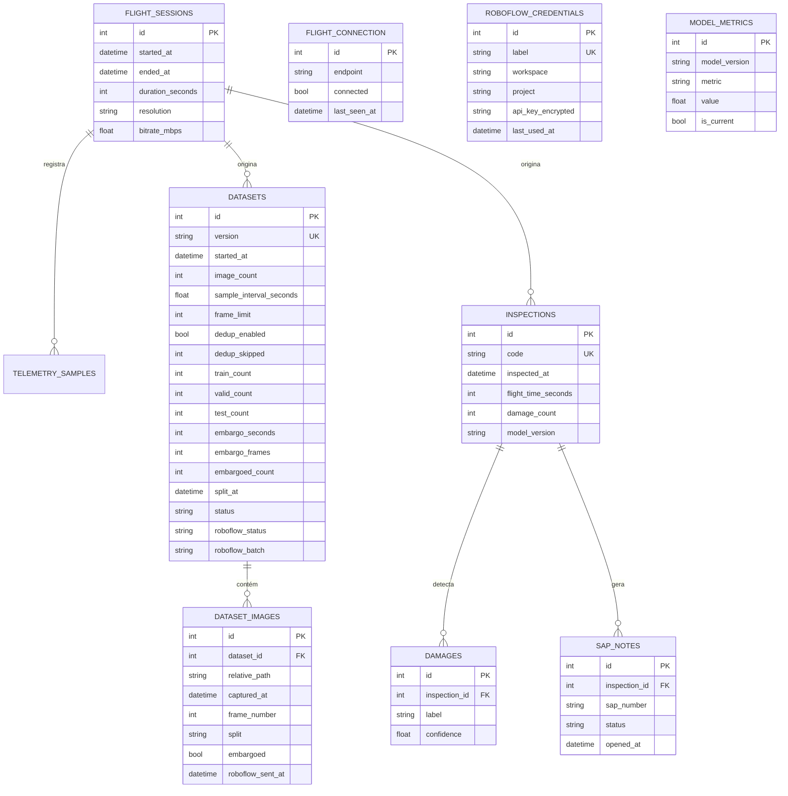

# Modelo de dados

## Escolha do banco

**PostgreSQL 16.** Os dados são relacionais e as perguntas da interface são
agregações: inspeções por dia, avarias por inspeção, notas abertas. Isso é SQL.

Alternativas consideradas:

- **SQLite** — ótimo para desenvolvimento, mas gera divergência entre o que
  roda na máquina e o que roda em produção. Fica só nos testes.
- **MongoDB** — a flexibilidade não ajuda aqui: o esquema é estável e as
  consultas são justamente as que um banco relacional faz melhor.
- **TimescaleDB** — vale a pena se a telemetria for gravada a cada segundo por
  muitos meses. É uma extensão do próprio Postgres, então a migração é aditiva.
  Ver [ADR 003](decisions/003-banco-de-dados.md).

**Imagens não vão para o banco.** Ficam em `/data/datasets/`, e a linha em
`dataset_images` guarda o caminho. Um voo de 20 minutos a 30 fps são 36 mil
frames — isso destrói backup, replicação e tempo de dump.

## Diagrama



## Decisões que valem explicar

`damage_count` fica **desnormalizado** em `inspections`. É contável a partir de
`damages`, mas o Dashboard lista dezenas de inspeções e faria um `COUNT` por
linha. O valor é escrito uma vez, quando a inspeção é processada.

`model_metrics` guarda **histórico**, com uma linha marcada `is_current`. O
MAPE do card é o valor corrente; o histórico permite mostrar depois se o modelo
melhorou entre versões, sem mudar o esquema.

`dataset_images.embargoed` é um campo, não uma ausência de split. Um frame
descartado por embargo não é um erro nem um dado faltando — foi uma decisão
deliberada, e a interface mostra quantos foram. Ver
[ADR 004](decisions/004-split-temporal.md).

`flight_connection` é uma tabela de linha única. Poderia ser um arquivo de
configuração, mas o endereço muda em operação, precisa sobreviver a restart do
container e deve ser o mesmo para todos os operadores.

## Migrations

O esquema é versionado com Alembic. Nada de `create_all` em produção.

```bash
make revision m="adiciona tabela pipeline_runs"   # gera
make migrate                                       # aplica
```

Toda migration gerada deve ser **lida antes de commitar** — o autogenerate
acerta na maioria dos casos e erra silenciosamente em alguns (renomear coluna
vira drop + add, que apaga dados).
