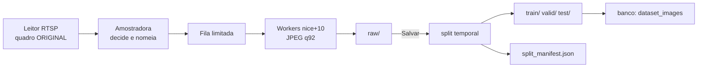
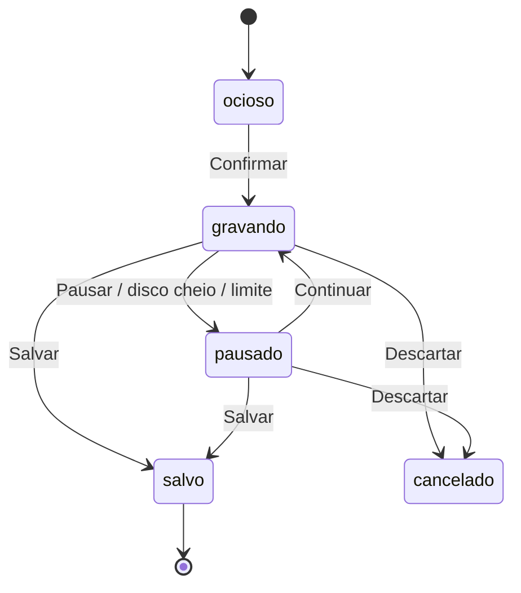
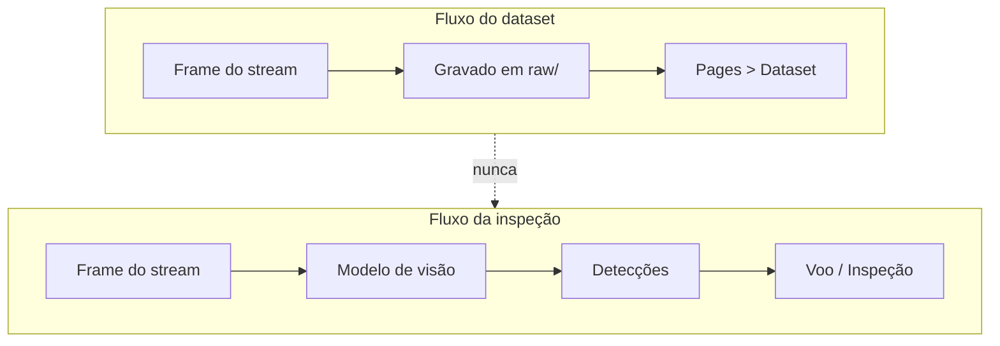

# Datasets

Um dataset é uma sessão de coleta salva. Ao salvar, ele ganha uma versão
(`v0.0`, `v0.1`, …) e é particionado em `train`, `valid` e `test`.

O ciclo completo é **voa → coleta → split → Roboflow → anota → treina**. Esta
página cobre os três primeiros; o quarto está em [Roboflow](roboflow.md).

## Onde cada coisa mora



Durante a gravação a verdade é o **disco**; o banco só é escrito no Salvar. Um
`INSERT` por quadro poria I/O de banco no caminho crítico do vídeo, e uma sessão
interrompida deixaria um dataset meio gravado em duas fontes em vez de uma. O
`session.json` incremental é o que permite recuperar.

!!! danger "Dataset mostra a imagem original. Voo mostra a processada."
    A coleta lê o quadro do slot do **leitor**, antes do detector. Ler do slot
    de saída gravaria a imagem com a sobreposição desenhada, e o treino seguinte
    aprenderia os erros do modelo anterior.

---

## Fase 2 — Coleta

### A guarda

O botão só habilita com os indicadores verdes, e a guarda vem do servidor:

```
GET /api/v1/flight/collection/preflight
```

| Condição | Bloqueia? | Motivo |
| --- | --- | --- |
| Stream | sim | sem path publicando não há quadro para gravar |
| MediaMTX | sim | sem broker não há RTSP |
| Disco | sim | acima de `DISK_LIMIT_PCT` a coleta não inicia |
| Túnel | **não** | informativo |

O túnel não bloqueia de propósito. Gravar depende de o quadro chegar ao leitor
RTSP local; por onde o drone alcançou o MediaMTX — túnel, IP público, rede
local — não muda nada depois que o stream está de pé. Exigi-lo travava a coleta
numa máquina com IP público, onde o túnel nem é usado.

Cada verificação traz `fix`, a instrução do que fazer. Um modal que diz apenas
"Stream ✕" faz quem está em campo adivinhar qual das quatro condições falhou.

```
Não é possível iniciar a coleta

✕ Stream — nenhum path ativo
  Confira o endereço no FlightHub e religue o toggle do canal.

✓ MediaMTX — no ar, API respondendo
✓ Túnel — dispensado (192.168.3.38)
✓ Disco — 59% usado · 201 GB livres
```

A guarda roda **duas vezes**: o botão a consulta antes de abrir o modal, e o
`start` a repete. Não é redundância — a tela pode estar olhando um estado de
dois segundos atrás, e o disco pode ter enchido nesse intervalo. Um botão
clicável que falha depois é pior que um botão desabilitado que explica.

### O modal de confirmação

| Parâmetro | Opções | Padrão |
| --- | --- | --- |
| Intervalo de amostragem | 0,5 / 1 / 2 / 5 s | 2 s |
| Limite de quadros | número ou vazio (ilimitado) | 500 |
| Deduplicação | on/off | on |

Os três ficam gravados em `datasets` porque explicam a forma do dataset: 500
quadros a 2 s com dedup ligado não é o mesmo dataset que 500 a 0,5 s sem dedup,
e seis meses depois ninguém lembra qual foi.

### Versionamento

`vMAJOR.MINOR`, com MINOR de 0 a 9 rolando para o próximo MAJOR:
`v0.0 → v0.1 → … → v0.9 → v1.0`.

A varredura é **do disco**, não de um contador. Um contador (`count(datasets)`)
volta a `v0.0` assim que alguém apaga uma linha, e a coleta seguinte escreve
dentro de uma pasta que já tem quadros.

A varredura também consulta a coluna `datasets.version`, que é única: uma linha
cuja pasta foi apagada à mão continua ocupando o número. Sem as duas listas, a
coleta seguinte morre numa violação de chave — um 500 sem explicação para quem
só clicou em coletar.

### Máquina de estados



A pausa automática — disco acima do limite, limite de quadros atingido —
acontece dentro da thread do gravador, que não escreve no banco. O estado é
reconciliado a cada leitura e um evento SSE avisa a tela; sem isso, `Continuar`
batia num 409 dizendo que a coleta estava "em recording" com a tela mostrando
PAUSADO ao lado.

Clicar em **Continuar** depois de o limite ser atingido dispensa o limite: é uma
decisão explícita de ignorá-lo. Mantê-lo faria a amostradora gravar um quadro e
pausar de novo a cada clique, e a tela pareceria travada sem nada errado
acontecendo.

**Descartar** para a gravação sem particionar. Os quadros ficam em `raw/` e
podem virar dataset depois, por *Refazer split*. Apagar a pasta seria mais limpo
na listagem e destruiria um voo inteiro no clique de quem só quis parar.

### Deduplicação

Cada quadro é comparado com o **último salvo**, em 128×128 cinza, pela diferença
média absoluta. Abaixo de `DEDUP_THRESHOLD` (padrão 2.0, medido no M4TD), é
descartado.

Contra o *anterior lido*, e não contra o último salvo, uma deriva lenta passaria
quadro a quadro e o dataset encheria de quase-duplicatas mesmo assim.

O número de descartes **aparece na tela**. Sem ele, o operador conta 25 amostras,
encontra 18 arquivos e passa a tarde procurando um erro que não existe.

### A coleta nunca degrada o vídeo

Exibir o vídeo é a função principal da tela; a coleta é secundária. Três
mecanismos garantem isso:

1. **A amostradora nunca faz I/O.** Ela decide, atribui o índice e entrega o
   quadro para a fila. Encode e escrita ficam com os workers.
2. **Fila limitada** (`COLLECT_QUEUE_MAX`). Cheia, o quadro é descartado na hora
   e contabilizado como `io_dropped`, visível na interface. Uma fila ilimitada
   trocaria latência por memória — cada item é um quadro decodificado inteiro.
3. **Workers com `os.nice`**, no máximo dois. Na disputa por CPU com o encode do
   MJPEG, quem cede é a coleta.

### Em disco durante a gravação

```
data/datasets/v0.3/
├── raw/
│   ├── 000001_t0.00.jpg
│   ├── 000002_t2.00.jpg
│   └── …
└── session.json
```

O nome não é decorativo. O índice zero-preenchido faz a ordem lexicográfica ser
a ordem temporal, e o `t` — segundos desde o **primeiro quadro salvo** — é o que
permite particionar sem reabrir o banco.

O tempo vem de `frame.captured_at`, o relógio monotônico do leitor. Não se usa
`frame.elapsed`: ele conta desde `session_started_at`, que o leitor rezera a
cada reconexão do RTSP, e uma reconexão no meio do voo faria os nomes voltarem
para `t0.00` — quebrando o split justamente no caso que a qualidade em
"Automático" torna comum.

`session.json` é gravado a cada 2 s com `tmp` + `os.replace`: uma queda no meio
da escrita deixa o arquivo anterior intacto, nunca um JSON truncado.

---

## Fase 3 — Split ao salvar

!!! danger "O split aleatório está errado aqui"
    A coleta grava a 30 fps. O frame N e o frame N+1 são a mesma cena deslocada
    por 33 ms. Um `train_test_split` aleatório coloca um em `train` e o outro em
    `valid` — o modelo acerta a validação porque já viu aquela imagem. A métrica
    reportada infla, e ela é exatamente o número que o card MAPE do Dashboard
    exibe para quem toma decisão.

Blocos **contíguos** na ordem cronológica, o passado treinando e o futuro
validando, com uma faixa de embargo em cada fronteira.

```mermaid
gantt
    title Divisão de uma coleta de 50 s
    dateFormat X
    axisFormat %S s
    section Partição
    train (70%)     :done, 0, 28
    embargo         :crit, 28, 33
    valid (15%)     :active, 33, 39
    embargo         :crit, 39, 44
    test (15%)      :active, 44, 50
```



### As duas unidades do embargo

O embargo é a **união** de uma janela de tempo (`SPLIT_EMBARGO_SECONDS`) e uma
janela de quadros (`SPLIT_EMBARGO_FRAMES`). Não é redundância: o M4TD media a
margem em quadros (`DEFAULT_MARGIN = 5`) e esta plataforma media em segundos, e
cada uma cobre um buraco da outra.

* Com deduplicação ligada o intervalo entre quadros salvos é irregular — dois
  vizinhos podem estar a 2 s ou a 40 s de distância. Uma margem só em quadros
  deixa de ser margem de tempo justamente aí.
* Com intervalo de amostragem de 5 s, uma margem só de 5 s descartaria um quadro
  de cada lado. É menos separação do que o M4TD aplicava.

Aplicando as duas, o descarte nunca é menor que o do protótipo.

### As margens encolhem em vez de esvaziar uma partição

Uma coleta curta com as margens cheias zera `valid`, e partição vazia não mede
nada. Em vez de recusar, as margens encolhem até caber — primeiro a de quadros,
depois a de segundos — e o manifesto registra o que foi aplicado
(`margem_reduzida`, `embargo_reduzido`). Abaixo de 10 quadros não há o que
particionar: tudo vai para `train` com aviso de nível `error`.

Isso é frequente em coleta de teste. Uma gravação de 20 s a 0,5 s produz 40
quadros; com 5 s de embargo, **todos** ficariam a menos de 5 s de alguma
fronteira e as três partições sairiam vazias de uma vez.

### O que fica em disco

```
data/datasets/v0.3/
├── train/images/
├── valid/images/
├── test/images/
├── raw/                    mantido — permite refazer o split
├── session.json
└── split_manifest.json
```

Copia, não move. `raw/` intacto é o único caminho de volta se a proporção sair
ruim ou se o operador excluir imagens.

O manifesto registra estratégia, proporções, embargo pedido e aplicado, contagem
por partição, fronteiras e o mapeamento de cada arquivo. **Sem ele não há como
reproduzir nem auditar o experimento** — é a única resposta para "por que este
quadro está em `valid`" seis meses depois.

### Configuração

```bash
SPLIT_TRAIN_RATIO=0.70
SPLIT_VALID_RATIO=0.15
SPLIT_TEST_RATIO=0.15
SPLIT_EMBARGO_SECONDS=5
SPLIT_EMBARGO_FRAMES=5
```

A decisão é uma função pura em `services/splitting.py` — recebe timestamps,
devolve rótulos. Quem executa em disco é `services/split_runner.py`. A separação
é o que permite testar a regra sem tocar arquivo, e reprocessar um dataset
antigo sem tocar o banco.

Detalhes e alternativas descartadas em [ADR 004](decisions/004-split-temporal.md).

---

## Fase 4 — A tela Dataset

### Galeria

Clicar num dataset abre o detalhe com abas `train`, `valid` e `test`, cada uma
com contagem e grade de miniaturas.

A grade pede `thumb_url` (240 px, ~7 kB); o visor pede `url`, o arquivo inteiro
(~45 kB). Mandar quinhentos JPEGs em tamanho real para montar uma grade trava a
aba — é o tipo de coisa que só aparece na primeira coleta grande de verdade, e
aí já é tarde. A miniatura é gerada sob demanda e cacheada em `.thumbs/`,
invalidada por mtime.

#### O endereço da imagem

O backend devolve os dois campos como **caminho** —
`/api/v1/datasets/13/images/3016/thumb`, por exemplo. Um caminho num ``
não passa pelo axios e é resolvido contra a origem da *página* — que em
desenvolvimento é o Vite na 5173, não a API na 8000. O Vite responde `index.html` a qualquer rota que não conheça, então o
navegador recebe HTML onde esperava JPEG: nada é desenhado, o console fica
limpo e no Network não aparece requisição alguma para `/thumb`. O sintoma é uma
grade de retângulos vazios com a listagem respondendo certo.

Quem resolve é `apiUrl()`, em `services/api/client.ts`, sobre a mesma
`VITE_API_BASE_URL` que o axios, o SSE e o MJPEG de `/flight/stream` já usam —
uma fonte só para o endereço da API, não duas. `datasetService.images()` aplica
a função nos dois campos antes de entregar ao hook, de modo que a galeria
recebe endereço pronto e não concatena nada; um `no-restricted-syntax` no
ESLint recusa literal começando com `/api/` em `components/`, `pages/` e
`hooks/`, do mesmo jeito que o `no-restricted-imports` recusa axios.

Proxy no Vite resolveria só a galeria e deixaria as imagens saindo por um
caminho diferente do resto — e não vale em produção, onde o nginx serve página
e API no mesmo host e `VITE_API_BASE_URL` nem é definida. Lá a base é relativa,
`apiUrl()` devolve o caminho intacto e nada muda.

| Ambiente | `VITE_API_BASE_URL` | `src` da miniatura |
| --- | --- | --- |
| Dev Container / Compose | `http://localhost:8000/api/v1` | `http://localhost:8000/api/v1/datasets/13/images/3016/thumb` |
| Produção (nginx) | não definida | `/api/v1/datasets/13/images/3016/thumb` |

### Demonstração e voo, na mesma tabela

A aplicação recém-clonada não pode abrir vazia — uma tela sem nada parece
quebrada, e quem nunca viu o sistema não distingue as duas coisas. Por isso o
`post-create.sh` roda o `seed.py`. Assim que voos reais entram, porém, as duas
fontes convivem na mesma listagem.

Cada linha carrega `source`, gravado no INSERT: `seed` ou `collected`. A marca
não é deduzida por data, faixa de id ou padrão de nome — qualquer heurística
desse tipo acerta hoje e erra no dia em que uma coleta real cair no meio dela.

| Onde | O que acontece |
| --- | --- |
| Listagem e detalhe | selo **demonstração** ao lado da versão |
| `python -m app.db.seed --clear` | remove só `source="seed"` |
| Botão *Remover demonstração* | o mesmo, exigindo digitar `remover demonstração` |
| `DELETE /api/v1/admin/seed` | a rota por trás do botão |

A regra mora em `services/demo_data_service.py`, compartilhada pelo comando e
pela rota: duas cópias divergiriam, e a que divergisse apagaria demais.

O botão fica em `/admin/seed`, e não em `/datasets`, porque apagar o seed toca
datasets, inspeções, notas e métricas ao mesmo tempo — uma rota de domínio
mexendo nos outros três seria a fronteira errada.

### Coleta vazia não deixa resíduo

Uma sessão que iniciou e não gravou quadro nenhum não é um dataset: é uma
tentativa. Mantê-la produzia uma linha de zero imagens que não dá para enviar ao
Roboflow nem reparticionar — e, pior, **queimava o número da versão**, porque
`next_version()` respeita tanto a pasta quanto a coluna `version`. Depois de
três tentativas frustradas, a primeira coleta de verdade saía como `v0.6`.

Ao encerrar — salvando ou cancelando — sem nenhum quadro, o serviço apaga a
pasta e o registro, publica `collection.discarded` e registra o motivo no log. O
número volta a ficar livre.

Cancelar uma coleta **com** quadros continua preservando tudo: um clique não
pode destruir um voo. O descarte automático vale só quando não há o que perder.

Para o resíduo anterior a esta regra:

```bash
python -m app.db.maintenance prune-empty
```

A guarda é dupla — contador zerado **e** `raw/` vazio em disco. As duas fontes
discordam justamente quando o banco perdeu uma linha, e apagar guiado só pelo
contador destruiria um voo que existe em disco.

### Excluir muda a proporção

Tirar 40 imagens de `train` desloca a divisão de 70/15/15 para outra coisa. O
detalhe mostra as contagens novas e oferece **Refazer split** a partir de
`raw/`.

A exclusão apaga da partição **e** de `raw/`. Só da partição faria o resplit —
oferecido justamente porque as proporções mudaram — ressuscitar tudo que o
operador acabou de excluir. Entre a irreversibilidade e um botão que desfaz o
trabalho de quem clicou, a irreversibilidade é o mal menor; por isso o modal diz,
em palavras, que não dá para desfazer.

### Duas fontes, uma verdade cada

| Pergunta | Fonte |
| --- | --- |
| O que existe agora nas pastas | disco, contado na hora (`counts`) |
| O que o split decidiu | `split_manifest.json` |
| Como cada quadro foi rotulado | banco (`dataset_images`) |

O manifesto **não é reescrito** quando alguém exclui uma imagem: ele registra um
evento, não o conteúdo atual das pastas. Reescrevê-lo faria o dataset deixar de
ser reproduzível, que é a única razão de ele existir. A divergência entre disco e
manifesto é calculada e exibida (`drifted`), não escondida — e é ela que
justifica o botão de refazer o split.

### Excluir o dataset inteiro

Exige digitar a versão. Apaga o banco e a pasta, sem volta.

---

## A cadeia completa

### Coletar

| Passo | Arquivo |
| --- | --- |
| Botão e guarda | `components/collection/CollectionPanel.tsx` |
| Modal do que falta | `components/collection/PreflightModal.tsx` |
| Modal de confirmação | `components/collection/StartCollectionModal.tsx` |
| Hooks e invalidação | `hooks/useFlight.ts` |
| Chamada HTTP | `services/api/flightService.ts` |
| Rota | `api/v1/routes/flight.py` |
| Guarda, estados, banco | `services/collection_service.py` |
| Threads, dedup, escrita | `services/collection_runtime.py` |
| Quadro original | `integrations/vision/stream.py` (`raw_frame`) |
| Pastas e versões | `services/dataset_storage.py` |

### Salvar e particionar

| Passo | Arquivo |
| --- | --- |
| `POST /flight/collection/save` | `api/v1/routes/flight.py` |
| Encerra o gravador, dispara o split | `services/collection_service.py` |
| Lê `raw/`, copia, escreve o manifesto | `services/split_runner.py` |
| Decide os rótulos (pura) | `services/splitting.py` |
| Popula `datasets` e `dataset_images` | `services/collection_service.py` |

### Ver, excluir, reparticionar

| Passo | Arquivo |
| --- | --- |
| Lista | `pages/datasets/DatasetsPage.tsx` |
| Detalhe, abas, avisos | `pages/datasets/DatasetDetailPage.tsx` |
| Grade, visor, exclusão em lote | `components/datasets/ImageGallery.tsx` |
| Hooks | `hooks/useDatasets.ts` |
| Chamadas HTTP | `services/api/datasetService.ts` |
| Rotas | `api/v1/routes/datasets.py` |
| Consulta, exclusão, resplit | `services/dataset_service.py` |
| Miniaturas e caminhos | `services/dataset_storage.py` |

## Endpoints

```
GET    /api/v1/flight/collection/preflight     o que falta para poder gravar
GET    /api/v1/flight/collection/current       coleta em curso, com contadores
POST   /api/v1/flight/collection/start         inicia com os parâmetros do modal
POST   /api/v1/flight/collection/pause
POST   /api/v1/flight/collection/resume
POST   /api/v1/flight/collection/save          encerra e particiona
POST   /api/v1/flight/collection/cancel        descarta sem particionar

GET    /api/v1/datasets                        lista
GET    /api/v1/datasets/{id}                   detalhe, contagens e avisos
GET    /api/v1/datasets/{id}/images?split=     galeria por partição
GET    /api/v1/datasets/{id}/images/{i}/thumb  miniatura de 240 px
GET    /api/v1/datasets/{id}/images/{i}/raw    imagem original
POST   /api/v1/datasets/{id}/images/delete     exclusão individual ou em lote
POST   /api/v1/datasets/{id}/resplit           refaz a partir de raw/
POST   /api/v1/datasets/{id}/delete            exige a versão digitada
```

## Fronteira que não pode ser cruzada



Na API a separação é física: `/datasets/{id}/images` só lê de `dataset_images`,
que nunca recebe frame processado. No backend ela é física também — a coleta lê
`video.raw_frame()`, o slot do leitor, e a tela Voo lê `video.latest()`, o slot
do worker de inferência.
