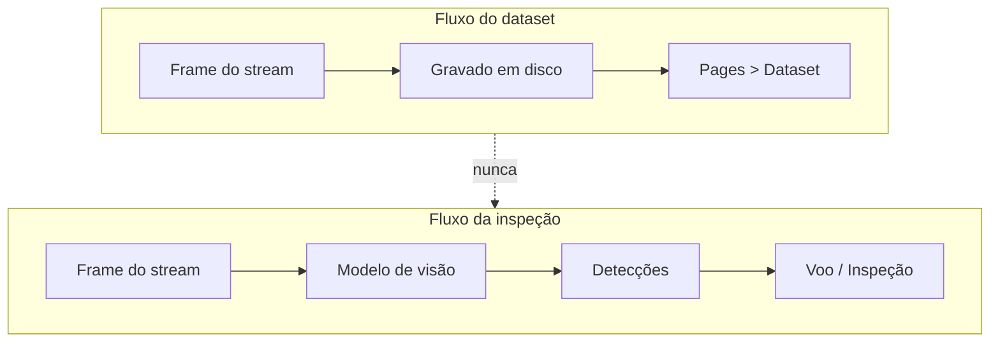

# Datasets

Um dataset é uma sessão de coleta salva. Ao salvar, ele ganha uma versão
(`v0.0`, `v0.1`, …) e é particionado.

## Divisão temporal

!!! danger "O split aleatório está errado aqui"
    A coleta grava a 30 fps. O frame N e o frame N+1 são a mesma cena deslocada
    por 33 ms. Um `train_test_split` aleatório coloca um em `train` e o outro em
    `valid` — o modelo acerta a validação porque já viu aquela imagem. A métrica
    reportada infla, e ela é exatamente o número que o card MAPE do Dashboard
    exibe para quem toma decisão.

A estratégia adotada é a de validação cruzada de séries temporais: blocos
**contíguos** na ordem cronológica, o passado treinando e o futuro validando,
com uma faixa de embargo em cada fronteira.


Sem o embargo, os frames imediatamente antes e depois do corte continuam sendo
quase duplicatas atravessando a divisa. Com ele, eles são descartados — e a
interface mostra quantos foram, porque senão a soma não bate com o total de
imagens e alguém perde uma tarde procurando o erro.

A configuração está em `.env`:

```bash
SPLIT_TRAIN_RATIO=0.70
SPLIT_VALID_RATIO=0.15
SPLIT_TEST_RATIO=0.15
SPLIT_EMBARGO_SECONDS=5
```

A implementação é uma função pura em `services/splitting.py` — recebe
timestamps, devolve rótulos. Sem I/O, sem banco, o que a torna barata de
testar. Os testes estão em `tests/test_splitting.py` e verificam a propriedade
que importa: `max(train) < min(valid) < min(test)`.

Detalhes e alternativas descartadas em [ADR 004](decisions/004-split-temporal.md).

## O que a página mostra

| Coluna | Origem |
| --- | --- |
| Versão | `datasets.version` |
| Data | `datasets.started_at` |
| Duração | `datasets.duration_seconds` |
| Imagens | `datasets.image_count` |
| Distribuição | Barra com train/valid/test + frames em embargo |
| Disco | `datasets.disk_bytes` |
| Roboflow | `datasets.roboflow_status` |

## Fronteira que não pode ser cruzada



A página **Dataset** mostra a imagem original. A página **Voo** mostra a imagem
com o resultado da rede aplicado. Um dataset contaminado com a saída do próprio
modelo faz o treinamento seguinte aprender os erros do anterior.

Na API, a separação é física: `/datasets/{id}/images` só lê de `dataset_images`,
que nunca recebe frame processado.
