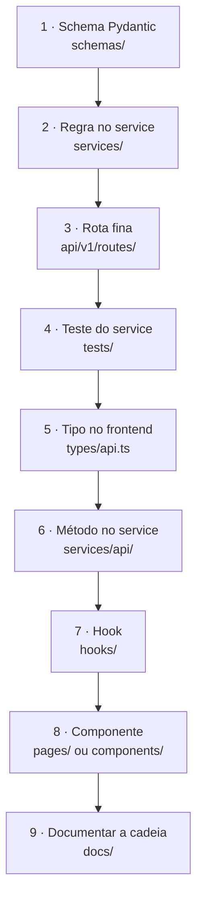

# Desenvolvimento

## Começando

```bash
git clone https://github.com/jmetrimiranda/fly_hub_system-front_end-.git
cd fly_hub_system-front_end-
cp .env.example .env
docker compose up
```

Sem Docker:

```bash
cd backend && pip install -r requirements-dev.txt && uvicorn app.main:app --reload
cd frontend && npm install && npm run dev
```

## Segredos

Nada de credencial no Git. O `.gitignore` cobre `.env`, `*.pem` e `*.key`; o
`.env.example` lista todas as variáveis com valores vazios ou de exemplo.

| Variável | Onde obter |
| --- | --- |
| `ROBOFLOW_API_KEY` | Roboflow → Settings → API Keys |
| `ROBOFLOW_WORKSPACE` / `PROJECT` | Na URL do projeto no Roboflow |
| `FLYHUB_*` | Configuração da instância MediaMTX/túnel |
| `POSTGRES_PASSWORD` | Gerado no deploy |

Se uma chave vazar, revogue **antes** de reescrever o histórico do Git —
o repositório já foi clonado por alguém.

## Adicionando uma funcionalidade

A regra é: funcionalidade nova nasce integrada à arquitetura e à documentação.
Um botão sem a cadeia completa não está pronto.



Começar pelo schema, e não pela tela, evita a situação de ter uma interface
pronta e descobrir que o dado que ela precisa não existe.

## Qualidade

```bash
make lint        # ruff no backend, eslint no frontend
make test        # pytest + vitest
```

Regras que valem a pena conhecer antes de escrever código:

- **Backend** — nada de regra de negócio em rota; toda entrada e saída tipada
  com Pydantic; erro previsto é classe em `core/errors.py`.
- **Frontend** — `axios` só dentro de `services/api/` (o ESLint bloqueia o
  resto); cores e espaçamentos só via token; chave de cache só via
  `lib/queryKeys.ts`.

## Migração do protótipo M4TD

Já existe um protótipo funcional em `flyhub_connecting/` que faz a fatia
vertical: MediaMTX, túnel, coleta de frames, particionamento, listagem de
datasets, SSE. **Este projeto não recomeça do zero.**

| Do protótipo | Destino |
| --- | --- |
| Consumo RTSP e leitura de frames | `services/collection_service.py` |
| Lógica de particionamento | `services/splitting.py` (com embargo adicionado) |
| Gestão do túnel e MediaMTX | `integrations/mediamtx/`, `integrations/flyhub/` |
| Carregamento de pesos e passthrough | `services/pipeline_service.py` |
| Canal SSE | `core/events.py` + `routes/flight.py` |
| Interface | Reconstruída em React sobre o design system |

Ordem sugerida da migração, para manter algo funcionando o tempo todo:

1. Subir a estrutura nova com dados de seed (já feito).
2. Portar `integrations/` e apontar o backend para o MediaMTX real.
3. Portar a coleta, validando contra um voo gravado.
4. Portar o pipeline.
5. Desligar o protótipo.

A distribuição `50 / 2 / 7` que aparece no protótipo (59 imagens) sugere que o
particionamento atual usa proporções diferentes das definidas aqui — vale
conferir qual comportamento é o desejado antes de portar.

## Convenções de commit

```text
feat(flight): adiciona pausa na coleta
fix(datasets): corrige contagem de frames em embargo
docs(api): documenta o canal SSE
refactor(services): extrai split para função pura
```

Um commit que muda comportamento e não atualiza a documentação está incompleto.
