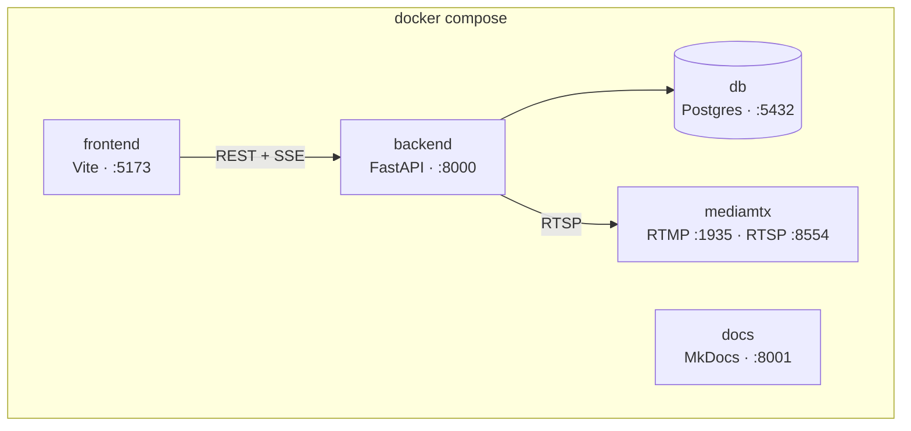

# Docker e Dev Container

## Serviços



O `mediamtx` está sob o profile `stream` e só sobe quando pedido — quem está
mexendo em interface não precisa de broker de vídeo:

```bash
docker compose up                    # frontend, backend, db, docs
docker compose --profile stream up   # inclui o mediamtx
```

## Dockerfiles multi-stage

Cada Dockerfile tem alvos `dev` e `prod`.

- **`dev`** — código montado por volume, reload ligado, ferramentas de teste
  presentes.
- **`prod`** — backend sem toolchain de build, rodando como usuário sem
  privilégio, com healthcheck; frontend compilado em estáticos servidos por
  nginx.

Em produção o nginx também faz proxy de `/api/` para o backend, o que elimina
CORS. O bloco de proxy desliga buffer e usa timeout longo — sem isso o SSE
chega em blocos ou é cortado.

## Volumes que precisam persistir

| Volume | Conteúdo | Se sumir |
| --- | --- | --- |
| `pgdata` | Banco | Perde inspeções, datasets, notas |
| `appdata` (`/data`) | Imagens e pesos do modelo | Perde os datasets coletados |

Em produção, apontar `/data` para storage real e incluir no backup.

## Dev Container e Codespaces

Abrir o repositório no Codespace ou em "Reopen in Container" executa
`.devcontainer/post-create.sh`, que cria o `.env`, aplica migrations e popula
dados de demonstração. As portas 5173, 8000, 8001 e 5432 são encaminhadas
automaticamente.

O `vite.config.ts` usa `usePolling: true` no watcher — em volume montado dentro
de container, o watcher nativo perde eventos e o HMR para de funcionar sem dar
erro.

## Comandos

```bash
make up          # sobe tudo
make seed        # dados de demonstração
make migrate     # aplica migrations
make test        # testes de backend e frontend
make docs        # documentação em http://localhost:8001
```
