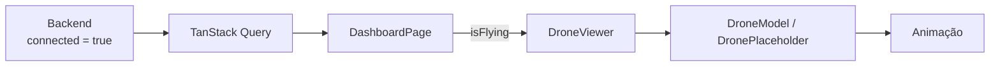
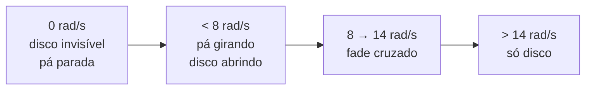

# Modelo 3D do drone

## Estratégia

**React Three Fiber** (renderer React para Three.js) + **Drei** (abstrações
prontas: `useGLTF`, `OrbitControls`, `ContactShadows`, `Environment`).

Three.js puro exigiria gerenciar montagem, desmontagem e loop de render na mão,
dentro do ciclo de vida do React — trabalho já resolvido pelo R3F. O par é o
padrão do ecossistema e casa com React 19.

## Desacoplamento

A cena **não conhece o backend**. A única entrada é uma booleana:

```tsx
<DroneViewer isFlying={summary.data?.flight_connection.connected ?? false} />
```



Isso mantém a cena testável isoladamente e reusável em qualquer outra tela.

## Comportamento

| `isFlying` | Corpo | Rotor | Sombra |
| --- | --- | --- | --- |
| `false` | No chão, rotação lenta de apresentação | Disco invisível, pá parada | Nítida e próxima |
| `true` | Sobe ~0,55 e flutua com oscilação leve | Disco translúcido aberto | Difusa e distante |

A velocidade acelera e desacelera com inércia (`MathUtils.damp`, em
`useSpinSpeed.ts`). Ligar e desligar no seco parece defeito de render, não um
drone.

## Por que disco, e não geometria girando

Hélice de drone gira a ~5000 RPM. A 60 fps isso passa de **uma volta por
quadro**: não existe velocidade de geometria que represente aquilo. Mesmo a
26 rad/s, que é a velocidade artística usada aqui, são **25° por quadro** — com
pá de 180° de simetria, já no limite do que o olho lê como rotação contínua.
Acelerar mais produz o efeito de roda de carroça girando para trás.

Simulador de voo resolve trocando a pá por um **disco translúcido** acima de um
limiar de velocidade. É o que o olho vê na realidade, e não estroba, porque não
há geometria girando.



Os limiares estão em `SPIN`, em `useSpinSpeed.ts`. `bladePresence()` devolve
quanto da pá ainda aparece; o disco usa o complemento, e é isso que faz a troca
ser cruzada em vez de um corte.

Consequência que importa mais que a estética: **a animação não depende de o
modelo ter hélices separadas**. Os discos são posicionados por geometria e
funcionam com um `.glb` de malha única.

## Onde os discos são desenhados

`DroneModel` percorre a cena procurando malhas com cara de hélice — achatadas em
Y e afastadas do centro no plano XZ. Se encontrar exatamente quatro, usa o centro
delas e o raio médio. Se não, cai para os quatro cantos da bounding box total, a
85% do meio-alcance, o que erra pouco em qualquer quadricóptero.

Quando a heurística errar em um modelo específico, o escape é a prop:

```tsx
<DroneModel isFlying={isFlying} propellerPositions={[[0.6, 0.2, 0.6], /* ... */]} />
```

O `DronePlaceholder` passa posições fixas, porque conhece a própria geometria.

## O modelo do Rodin

O `.glb` vem do **Hyper3D Rodin**. Mesmo usando *Bang to Parts*, as peças saem
nomeadas `part_0`, `part_1`… — depender do nome deixaria a cena refém de como o
exportador batizou os objetos. Por isso a detecção por nome
(`/prop|blade|rotor|h[ée]lice/i`) continua existindo, mas como **refinamento**:
se as pás estiverem lá, elas giram até 8 rad/s e somem em fade cruzado. Se não
estiverem, os discos bastam — e não há mais aviso no console, porque deixou de
ser problema.

Fluxo de exportação:

1. No Rodin, gerar o modelo e aplicar **Bang to Parts**, depois **Pack**.
2. Exportar como **glTF 2.0 binário** (`.glb`).
3. Otimizar (ver abaixo).
4. Copiar para `frontend/public/models/drone.glb`.
5. Definir `VITE_DRONE_MODEL_URL` — sem essa variável o `DroneViewer` usa o
   placeholder.

Para conferir o que saiu, sem abrir o Blender:

```bash
node scripts/inspect-glb.mjs frontend/public/models/drone.glb
```

O script lista nome, tipo, contagem de vértices e bounding box de cada nó, e
diz ao final quantos nós têm nome de hélice. Ele usa `@gltf-transform/core`,
que é `devDependency` do frontend.

### Separar as pás no Blender (opcional)

Só vale a pena para ganhar o fade cruzado — a animação já funciona sem isso:

1. Importar o `.glb`.
2. Modo de edição → selecionar cada hélice → **P → Separação por seleção**.
3. Renomear os quatro objetos: `prop_fl`, `prop_fr`, `prop_rl`, `prop_rr`.
4. Conferir que o **origin** de cada um está no centro de rotação
   (`Object → Set Origin → Origin to Geometry`) — senão a hélice orbita em vez
   de girar no próprio eixo.
5. Exportar como glTF 2.0 binário.

## Movimento reduzido

Com `prefers-reduced-motion: reduce`, o CSS do tema silencia animação e
transição — mas o que roda dentro do `useFrame` é invisível para o CSS. Por isso
`usePrefersReducedMotion` existe dentro de `drone3d/`: com a preferência ativa,
não há flutuação, inclinação, órbita de apresentação nem giro do disco. A cena
continua indicando o estado — o drone assume a altura de voo e o disco a
opacidade correspondente —, só não anima.

## Otimização

```bash
npx gltf-transform optimize drone.glb drone.optimized.glb --texture-compress webp
```

Compressão Draco costuma reduzir bastante um modelo gerado. O `vite.config.ts`
já separa `three` em um chunk próprio, para que o peso do 3D não atrase o
carregamento do Dashboard.

## Sem o arquivo

O binário não vai para o Git (`.gitignore` cobre `*.glb`). Enquanto ele não
estiver em `public/models/`, a aplicação usa o `DronePlaceholder` — um drone de
blocos com **a mesma animação**. O Dashboard funciona no primeiro
`docker compose up`, sem depender de um binário de 20 MB no repositório.

## Desempenho

Três medidas já aplicadas: `dpr={[1, 2]}` limita o pixel ratio, `ContactShadows`
substitui shadow map completo, e o `Environment preset` evita carregar HDRI
externo. Se a tela ficar aberta o dia todo em máquina fraca, o próximo passo é
`frameloop="demand"` com invalidação manual.
