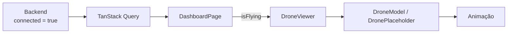

# Modelo 3D do drone

## Estratégia

**React Three Fiber** (renderer React para Three.js) + **Drei** (abstrações
prontas: `useGLTF`, `OrbitControls`, `ContactShadows`, `Environment`).

Three.js puro exigiria gerenciar montagem, desmontagem e loop de render na mão,
dentro do ciclo de vida do React — trabalho já resolvido pelo R3F. O par é o
padrão do ecossistema e casa com React 19.

## Desacoplamento

A cena **não conhece o backend**. A única entrada é uma booleana:

```tsx
<DroneViewer isFlying={summary.data?.flight_connection.connected ?? false} />
```



Isso mantém a cena testável isoladamente e reusável em qualquer outra tela.

## Comportamento

| `isFlying` | Corpo | Hélices | Sombra |
| --- | --- | --- | --- |
| `false` | No chão, rotação lenta de apresentação | Paradas | Nítida e próxima |
| `true` | Sobe ~0,55 e flutua com oscilação leve | Girando | Difusa e distante |

A rotação acelera e desacelera com inércia (`MathUtils.damp`). Ligar e desligar
no seco parece defeito de render, não um drone.

## ⚠️ O ponto que vai dar trabalho

O modelo veio do **Hyper3D Rodin**. Geradores desse tipo costumam exportar uma
**malha única**, sem as hélices como objetos separados. Sem objetos separados,
não há o que girar.

Verifique antes de integrar:

```bash
npx gltf-transform inspect public/models/drone.glb
```

Se a saída mostrar um único mesh, é preciso separar no Blender:

1. Importar o `.glb`.
2. Modo de edição → selecionar cada hélice → **P → Separação por seleção**.
3. Renomear os quatro objetos: `prop_fl`, `prop_fr`, `prop_rl`, `prop_rr`.
4. Conferir que o **origin** de cada um está no centro de rotação
   (`Object → Set Origin → Origin to Geometry`) — senão a hélice orbita em vez
   de girar no próprio eixo.
5. Exportar como glTF 2.0 binário.

O `DroneModel` procura nós cujo nome case com `/prop|blade|rotor|h[ée]lice/i`.
Se não encontrar nenhum, avisa uma vez no console e anima só o corpo — a tela
não quebra.

## Otimização

```bash
npx gltf-transform optimize drone.glb drone.optimized.glb --texture-compress webp
```

Compressão Draco costuma reduzir bastante um modelo gerado. O `vite.config.ts`
já separa `three` em um chunk próprio, para que o peso do 3D não atrase o
carregamento do Dashboard.

## Sem o arquivo

O binário não vai para o Git (`.gitignore` cobre `*.glb`). Enquanto ele não
estiver em `public/models/`, a aplicação usa o `DronePlaceholder` — um drone de
blocos com **a mesma animação**. O Dashboard funciona no primeiro
`docker compose up`, sem depender de um binário de 20 MB no repositório.

## Desempenho

Três medidas já aplicadas: `dpr={[1, 2]}` limita o pixel ratio, `ContactShadows`
substitui shadow map completo, e o `Environment preset` evita carregar HDRI
externo. Se a tela ficar aberta o dia todo em máquina fraca, o próximo passo é
`frameloop="demand"` com invalidação manual.
