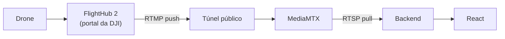
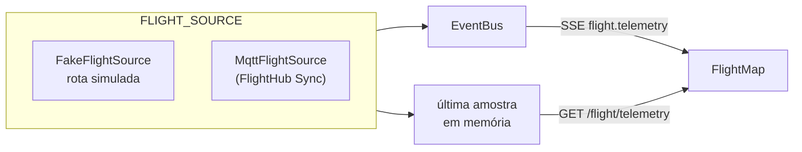
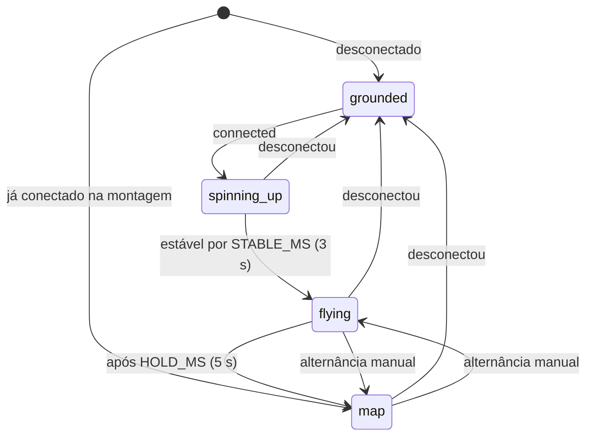
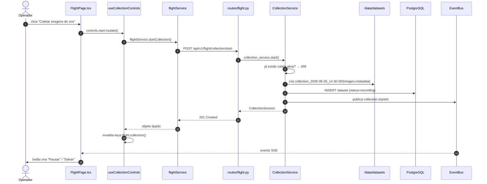
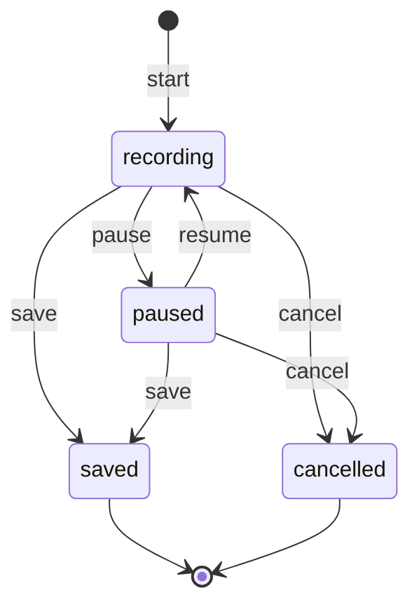

# Voo e coleta

## Como a conexão realmente funciona

O FlightHub 2 não expõe API de controle para este caso de uso. O que ele faz é
**publicar** o vídeo em um endereço RTMP que o operador cola no portal da DJI.
Tudo o que o backend controla é o lado receptor.



Duas consequências que costumam surpreender quem chega ao projeto:

1. **Resolução e bitrate não são configuráveis aqui.** Saem do encoder da
   aeronave e só mudam no portal da DJI. A interface mostra os valores; não
   oferece controle que não existe.
2. **O endereço do túnel muda a cada reinício.** Depois de colar o novo
   endereço no FlightHub, é preciso reeditar o canal de encaminhamento e
   desligar e religar o toggle — sem isso o drone continua publicando no
   endereço antigo. Esse aviso está na interface, na página Voo.

## De onde vem a telemetria

A conexão real com o FlightHub vive em outro projeto e ainda não foi integrada.
Enquanto isso, o backend não fica sem posição: quem produz telemetria é uma
**fonte** escolhida por configuração, atrás de um protocolo único.

```python
class FlightSource(Protocol):
    async def start(self) -> None: ...
    async def stop(self) -> None: ...
    async def current(self) -> Telemetry | None: ...
```

Uma fonte é uma tarefa de segundo plano. Ela publica cada amostra no `EventBus`
como `flight.telemetry` e guarda a última em memória, de onde `current()` a
devolve. O `lifespan` da aplicação a inicia e a para; ninguém mais toca nela.



**Esta é a costura.** Quando o código MQTT chegar, `MqttFlightSource` implementa
o mesmo protocolo — assina o broker, publica no bus, cacheia a última — e a
troca é uma linha em `flight_source/__init__.py`. Nem o service, nem a rota, nem
o mapa sabem de onde veio o dado.

| Elo | Arquivo |
| --- | --- |
| Protocolo e `Telemetry` | `backend/app/integrations/flight_source/base.py` |
| Simulação | `backend/app/integrations/flight_source/fake.py` |
| Escolha da fonte | `backend/app/integrations/flight_source/__init__.py` |
| Ciclo de vida | `backend/app/main.py` (`lifespan`) |
| Service | `backend/app/services/flight_service.py` → `telemetry()` |
| Rota | `GET /api/v1/flight/telemetry` |

### `FLIGHT_SOURCE=fake`

Padrão de propósito: quem clona o repositório vê a aplicação inteira
funcionando, sem hardware. Além da telemetria, a fonte simulada também faz o
`FlyHubClient.probe()` responder broker e stream no ar — sem isso `connected`
seria eternamente falso e metade da interface nunca apareceria.

A rota é uma varredura do píer do Terminal Marítimo de Ponta Ubu
(`-20.78667, -40.57333`): decola do centro, entra na área, faz quatro passadas
paralelas a 60 m e volta para pousar no ponto de partida. Ao fechar o ciclo
recomeça. Velocidade de cruzeiro de 6 m/s, amostras a 1 Hz, ruído gaussiano de
0,4 m na posição — sem ele o traçado sai perfeito demais e não exercita a
suavização do mapa. O gerador usa `random.Random(42)`, o mesmo seed do
`seed.py`: o voo simulado é reprodutível.

`FLIGHT_SOURCE=mqtt` levanta `NotImplementedError` na subida, com a mensagem
dizendo onde implementar. Falhar em silêncio seria pior.

### O evento carrega o dado

`flight.telemetry` é o **único** evento SSE que traz o payload em vez de só
avisar que algo mudou. A 1 Hz, seguir o ADR 002 custaria uma requisição HTTP por
segundo por cliente conectado. A exceção, o motivo e o limite dela estão no
[ADR 006](decisions/006-telemetria-no-evento.md).

O endpoint `GET /flight/telemetry` continua existindo, mas para outra coisa: o
mapa se posiciona na montagem sem esperar o próximo tick. Devolve `204` enquanto
a fonte não tiver produzido amostra alguma.

## Painel de voo do Dashboard

O painel da direita do Dashboard não é mais só a cena 3D. Ele acompanha a
conexão e, em voo estável, dá lugar ao mapa com a posição da aeronave.



| Estado | Mostra | Rótulo |
| --- | --- | --- |
| `grounded` | Drone parado, hélices imóveis | `EM SOLO` |
| `spinning-up` | Hélices acelerando, decolagem | `DECOLANDO` |
| `flying` | Drone em voo | `EM VOO` |
| `map` | Mapa com marcador e rastro | — |

Quatro regras decidem o comportamento, e cada uma existe por um motivo:

- **Qualquer `connected: false` derruba para `grounded` na hora**, zerando os
  dois temporizadores. É isso que impede o painel de piscar com sinal instável.
- **Já conectado na primeira renderização entra direto em `map`.** A cerimônia
  da decolagem marca a transição; não deve ser pedágio a cada recarga.
- **Alternância manual trava o automático** até desconectar. Quem escolheu ver o
  drone não é arrastado de volta ao mapa em cinco segundos.
- **Desconectar destrava** e volta a `grounded`.

A máquina vive em `useFlightPanelState.ts`, separada do componente: a parte
difícil aqui é temporal, e testar tempo dentro de uma cena com `Canvas` é
inviável. Com ela isolada, os timers falsos do Vitest cobrem a sequência inteira
em milissegundos.

### O mapa

`react-leaflet`, carregado por `import()` dinâmico dentro de `<Suspense>` — o
Leaflet só é baixado quando o painel troca para o mapa pela primeira vez, no
mínimo oito segundos depois de conectar.

- Tiles do OpenStreetMap, com a atribuição obrigatória visível. As duas
  constantes ficam nomeadas no topo do arquivo: num terminal portuário a imagem
  de satélite é mais legível que mapa de ruas, e a troca é substituí-las.
- Marcador em `divIcon` com SVG de seta rotacionada por `heading_deg` — precisa
  girar e sair na cor do tema, o que imagem não faz.
- Rastro em `Polyline` com as últimas 120 posições (2 min a 1 Hz).
- **Interpolação:** a 1 Hz o marcador andaria aos saltos, e salto de segundo em
  segundo lê como travamento, não como voo. Ele percorre o trecho entre a
  amostra anterior e a atual com `requestAnimationFrame`, direto no objeto do
  Leaflet — reposicionar por estado seria re-renderizar a árvore a 60 Hz.
- Recentra só quando o drone sai dos 60% centrais da viewport. Recentrar a cada
  amostra tira o mapa da mão de quem está arrastando.
- `prefers-reduced-motion` desliga a interpolação: o marcador salta de posição,
  o painel ainda troca de estado.

A posição e o rastro ficam em `useState` local de `useTelemetry()` — não no
TanStack Query e não no Zustand. É dado de alta frequência que não é estado de
servidor cacheável nem estado de aplicação (ADR 001).

| Elo | Arquivo |
| --- | --- |
| Painel e alternância | `frontend/src/components/flightpanel/FlightPanel.tsx` |
| Máquina de estados | `frontend/src/components/flightpanel/useFlightPanelState.ts` |
| Mapa | `frontend/src/components/map/FlightMap.tsx` |
| Telemetria no cliente | `frontend/src/hooks/useTelemetry.ts` |
| Ponte SSE | `frontend/src/hooks/useServerEvents.ts` |
| Service | `frontend/src/services/api/flightService.ts` → `getTelemetry()` |

## Rastreabilidade — botão "Coletar Imagens do Voo"



| Elo | Arquivo |
| --- | --- |
| Componente | `frontend/src/pages/flight/FlightPage.tsx` |
| Hook | `frontend/src/hooks/useFlight.ts` → `useCollectionControls` |
| Service (front) | `frontend/src/services/api/flightService.ts` |
| Rota | `backend/app/api/v1/routes/flight.py` |
| Service (back) | `backend/app/services/collection_service.py` |
| Persistência | `backend/app/models/dataset.py` |

## Estrutura em disco

```text
/data/datasets/
└── collection_2026-08-26_14-30-00/
    ├── images/
    │   ├── frame_000000.jpg
    │   └── frame_000001.jpg
    ├── metadata/
    │   └── frames.jsonl
    └── collection.json
```

Cada frame carrega `captured_at` e `frame_number`. Os dois juntos permitem
reconstruir a ordem temporal exata mesmo se os arquivos forem copiados fora de
ordem — e é dessa ordem que o split temporal depende.

## Máquina de estados da coleta



As transições são validadas no **backend**. Desabilitar um botão na interface
é conveniência para o usuário, não segurança: uma segunda aba, um clique duplo
ou um `curl` chegam na mesma rota.

## Pipeline

Liga e desliga o consumo do stream pelo modelo. Este projeto **não executa** a
inferência — comanda o processo que a outra equipe entrega e reporta o estado.

Quando não há arquivo de pesos em `/data/models/best.pt`, a aplicação roda em
passthrough: o vídeo passa intacto e nada é detectado. A interface diz isso com
todas as letras em vez de mostrar um estado vazio ambíguo.

O estado hoje vive em memória (`PipelineService`). Ao rodar mais de uma réplica,
mover para uma tabela `pipeline_runs` — a interface pública da classe não muda.
