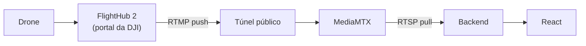
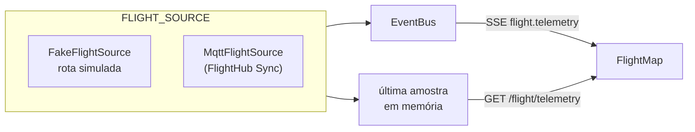
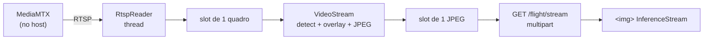
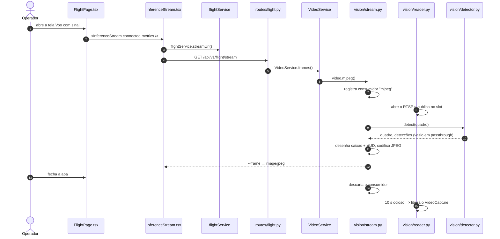
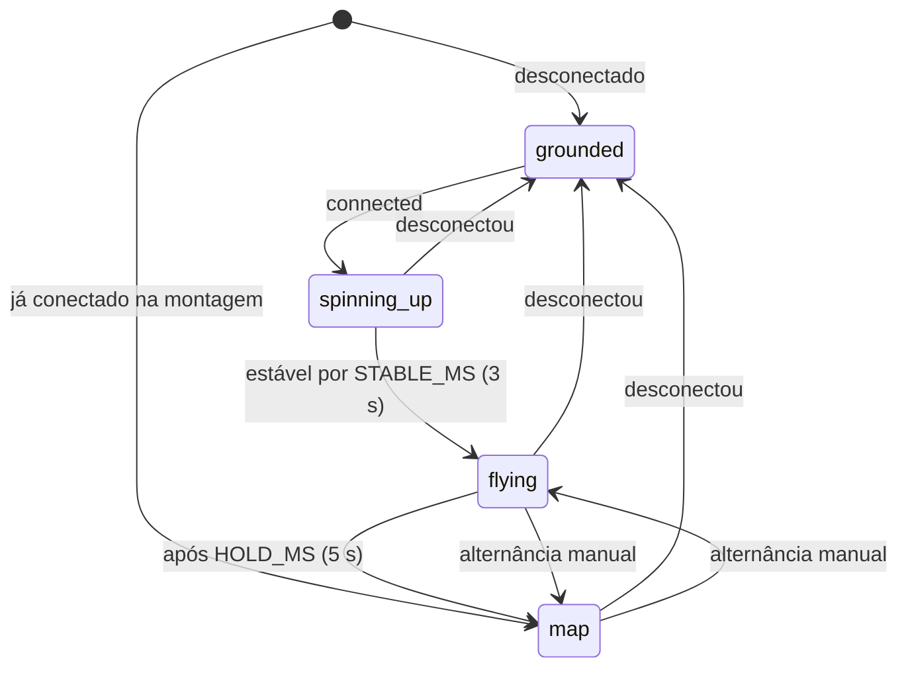
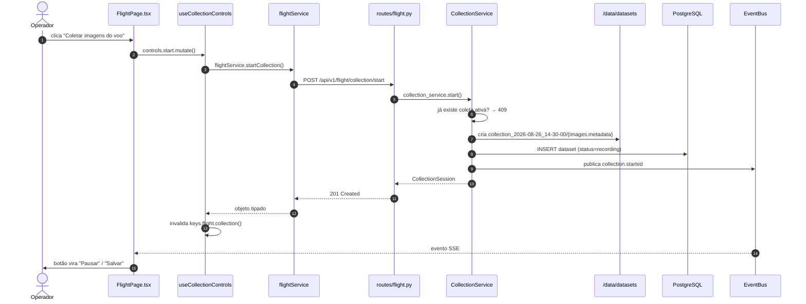
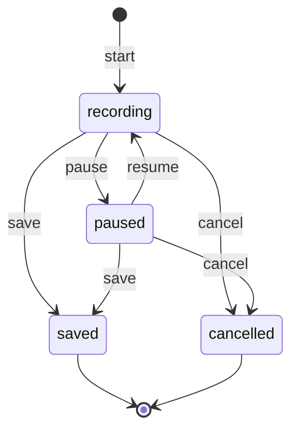

# Voo e coleta

## Como a conexão realmente funciona

O FlightHub 2 não expõe API de controle para este caso de uso. O que ele faz é
**publicar** o vídeo em um endereço RTMP que o operador cola no portal da DJI.
Tudo o que o backend controla é o lado receptor.



Duas consequências que costumam surpreender quem chega ao projeto:

1. **Resolução e bitrate não são configuráveis aqui.** Saem do encoder da
   aeronave e só mudam no portal da DJI. A interface mostra os valores; não
   oferece controle que não existe.
2. **O endereço não muda mais entre reinícios — desde que haja host fixo.**
   Com `FLYHUB_PUBLIC_HOST` definido (o `PUBLIC_HOST` do `start.sh` do M4TD), o
   endereço é estável; o túnel só existe para máquina sem IP público, e é o
   endereço *dele* que muda a cada reinício. Em qualquer um dos dois casos,
   depois de colar o endereço no FlightHub é preciso reeditar o canal de
   encaminhamento e desligar e religar o toggle — sem isso o drone continua
   publicando no endereço antigo. Esse aviso está na interface, na página Voo.

## De onde vem a telemetria

A conexão real com o FlightHub vive em outro projeto e ainda não foi integrada.
Enquanto isso, o backend não fica sem posição: quem produz telemetria é uma
**fonte** escolhida por configuração, atrás de um protocolo único.

```python
class FlightSource(Protocol):
    async def start(self) -> None: ...
    async def stop(self) -> None: ...
    async def current(self) -> Telemetry | None: ...
```

Uma fonte é uma tarefa de segundo plano. Ela publica cada amostra no `EventBus`
como `flight.telemetry` e guarda a última em memória, de onde `current()` a
devolve. O `lifespan` da aplicação a inicia e a para; ninguém mais toca nela.



**Esta é a costura.** Quando o código MQTT chegar, `MqttFlightSource` implementa
o mesmo protocolo — assina o broker, publica no bus, cacheia a última — e a
troca é uma linha em `flight_source/__init__.py`. Nem o service, nem a rota, nem
o mapa sabem de onde veio o dado.

| Elo | Arquivo |
| --- | --- |
| Protocolo e `Telemetry` | `backend/app/integrations/flight_source/base.py` |
| Simulação | `backend/app/integrations/flight_source/fake.py` |
| Escolha da fonte | `backend/app/integrations/flight_source/__init__.py` |
| Ciclo de vida | `backend/app/main.py` (`lifespan`) |
| Service | `backend/app/services/flight_service.py` → `telemetry()` |
| Rota | `GET /api/v1/flight/telemetry` |

### `FLIGHT_SOURCE=fake`

Padrão de propósito: quem clona o repositório vê a aplicação inteira
funcionando, sem hardware. Além da telemetria, a fonte simulada também faz o
`FlyHubClient.probe()` responder broker e stream no ar — sem isso `connected`
seria eternamente falso e metade da interface nunca apareceria.

A rota é uma varredura do píer do Terminal Marítimo de Ponta Ubu
(`-20.78667, -40.57333`): decola do centro, entra na área, faz quatro passadas
paralelas a 60 m e volta para pousar no ponto de partida. Ao fechar o ciclo
recomeça. Velocidade de cruzeiro de 6 m/s, amostras a 1 Hz, ruído gaussiano de
0,4 m na posição — sem ele o traçado sai perfeito demais e não exercita a
suavização do mapa. O gerador usa `random.Random(42)`, o mesmo seed do
`seed.py`: o voo simulado é reprodutível.

`FLIGHT_SOURCE=mqtt` levanta `NotImplementedError` na subida, com a mensagem
dizendo onde implementar. Falhar em silêncio seria pior.

### O evento carrega o dado

`flight.telemetry` é o **único** evento SSE que traz o payload em vez de só
avisar que algo mudou. A 1 Hz, seguir o ADR 002 custaria uma requisição HTTP por
segundo por cliente conectado. A exceção, o motivo e o limite dela estão no
[ADR 006](decisions/006-telemetria-no-evento.md).

O endpoint `GET /flight/telemetry` continua existindo, mas para outra coisa: o
mapa se posiciona na montagem sem esperar o próximo tick. Devolve `204` enquanto
a fonte não tiver produzido amostra alguma.

## O vídeo com inferência

A tela Voo mostra o quadro **depois** da inferência. É a única tela que mostra
imagem processada: Dataset mostra sempre a original, e as duas nunca se
misturam.



**Entre os estágios há um slot de um quadro, não uma fila.** Publicar
sobrescreve o que estiver lá e conta o quadro como perdido; quem consome sempre
pega o mais recente. É isso que impede a latência de acumular quando a
inferência é mais lenta que o stream — com fila, nada se perderia e a latência
cresceria sem teto. A inferência roda uma vez por quadro, não uma vez por
cliente: dois navegadores abertos não dobram o custo.

### O RTSP só é consumido quando alguém precisa

O `Consumers` registra quem precisa da conexão aberta, com dois tipos: `mjpeg`
(um por resposta multipart aberta) e `collect` (uma sessão de gravação, que
entra com a coleta de quadros). A decisão de fechar olha o **total**, nunca a
contagem de clientes HTTP: durante uma coleta pode não haver navegador nenhum
aberto e o leitor tem que continuar. Sem consumidor por dez segundos, o
`VideoCapture` é liberado e o path do MediaMTX perde o leitor.

### Sem sinal, a resposta não encerra

O gerador MJPEG passa a emitir um quadro sintético com o motivo, a ~1 fps.
Encerrar o multipart deixaria um ícone quebrado na tela e obrigaria o navegador
a reconectar; assim, quando o stream volta, a imagem volta sozinha na mesma
conexão. O player ainda trata `onError` — com mensagem e botão de tentar de
novo — porque a resposta pode cair por outros motivos, e `` quebrado não é
estado aceitável em tela de operação.

### Reconexão

Backoff exponencial de 1 s dobrando até o teto de 10 s. Duas sutilezas que
vieram medidas do M4TD e não devem ser desfeitas:

- **O backoff é zerado por um quadro lido, não por uma conexão aberta.** Um path
  que abre e nunca entrega quadro reiniciava o backoff a cada ciclo — uma
  abertura de RTSP por segundo, para sempre, cada uma custando um FFmpeg
  inteiro.
- **O leitor não tenta abrir quando o broker diz que não há path.** Nesse estado
  a espera é de um segundo relendo o cache do `PathProbe`, e não o backoff
  acumulado; a captura recomeça quase imediatamente quando o drone volta.

### O modelo é opcional

Sem arquivo de pesos, `Detector.detect()` devolve o quadro intacto e nenhuma
detecção. Isso não é erro: é o ponto de partida do projeto — o objetivo da
coleta é criar o dataset para treinar o primeiro modelo. São três estados, e a
tela sempre diz em qual está, porque ver vídeo cru achando que são detecções
reais é pior do que não ver nada:

| `model_loaded` | `model_enabled` | `model_error` | Badge |
| --- | --- | --- | --- |
| `true` | `true` | `null` | `MODELO best.pt` (verde) |
| `true` | `false` | `null` | `MODELO DESLIGADO — vídeo cru` (amarelo) |
| `false` | — | `null` | `SEM MODELO — vídeo cru` (amarelo) |
| `false` | — | texto | `MODELO NÃO CARREGOU — vídeo cru` (vermelho) |

As três últimas linhas produzem a **mesma imagem** — vídeo cru, nenhuma caixa —
por três causas diferentes. Por isso o badge nunca fica em silêncio: ver vídeo
cru achando que o modelo não detectou nada é pior que não ver vídeo.

`ultralytics` é importado **dentro** da função de carga, nunca no topo do
módulo: ele arrasta torch (~2,5 GB) e a aplicação precisa subir sem ele. Por
isso ele mora em `backend/requirements-vision.txt`, separado. Os pesos são
recarregados sozinhos quando o arquivo muda — o operador copia o `best.pt` para
`MODELS_DIR` com a aplicação no ar e a tela muda de estado em segundos.

### O modelo: entrega, toggle e vigia

Quem treina copia dois arquivos para `models/` (montada como `/models`) e não
faz mais nada. A cadeia que sustenta essa promessa:

| Peça | Arquivo | Responsabilidade |
| --- | --- | --- |
| `Detector` | `integrations/vision/detector.py` | carrega, infere, relê por `mtime`, lê o `metrics.json` ao lado |
| `ModelService` | `services/model_service.py` | traduz o estado para a tela, persiste o toggle, grava as métricas |
| `watch()` | `services/model_service.py` | percebe o arquivo novo e publica `model.changed` |
| Rotas | `api/v1/routes/model.py` | `GET /model`, `POST /model/toggle`, `POST /model/reload` |
| `useModel` | `frontend/src/hooks/useModel.ts` | consulta e mutações; o SSE invalida |
| `ModelPanel` | `frontend/src/components/model/ModelPanel.tsx` | toggle, recarregar, métricas |

O **vigia** não é redundância do hot-reload do `Detector`: aquele acontece
dentro de `detect()`, e com ninguém assistindo ao vídeo `detect()` não é
chamado. Sem o laço, a pessoa copiaria o `best.pt` e a tela continuaria dizendo
"sem modelo" até alguém abrir o stream.

**Toggle e reload são ações distintas.** `toggle` liga e desliga a inferência
mantendo os pesos em memória; `reload` relê o disco. Juntá-las impediria
comparar detecção ligada e desligada no mesmo voo — o primeiro teste que se faz
ao receber um modelo novo — e cada alternância pagaria de novo o custo da carga.

O estado do toggle vive em `app_settings`, não em memória: reiniciar o backend
não pode religar sozinho um modelo que o operador desligou de propósito.

O passo a passo para quem só treina está em
[Onde colocar o peso do modelo](modelo/index.md).

### A tabela CONEXÃO

Metade vem do broker, metade do leitor, e as duas se encontram em
`FlightService._metrics()`:

| Coluna | Origem |
| --- | --- |
| Resolução | `tracks2[].codecProps` do MediaMTX; o leitor é a reserva |
| Taxa | derivada de `bytesReceived` entre duas consultas |
| FPS captura | medido no leitor, janela deslizante de 3 s |
| FPS inferência | medido no worker, mesma janela |
| Latência | do instante de captura até o JPEG pronto |
| Quadros perdidos | sobrescritos no slot sem ninguém consumir |
| Tempo de stream | desde que o leitor abriu o RTSP; sem leitor, o `readyTime` do broker |

Com o modelo carregado, o FPS de inferência cai e o de captura não — a diferença
entre os dois é exatamente o que vira quadro perdido.

### O aviso de mudança de resolução

Quando a resolução decodificada muda, `resolution_change` é preenchido e a tela
exibe um aviso acima do vídeo. Acontece com a qualidade do canal em "Automático"
no FlightHub e é a causa mais comum de queda da captura. Três decisões:

- **A comparação atravessa reconexões**, de propósito: trocar a qualidade do
  canal derruba a sessão RTSP e a resolução nova só aparece na reconexão
  seguinte. Zerar ali apagaria o aviso justamente no caso que ele existe para
  pegar.
- **Não é dispensável pela interface.** Enquanto a resolução oscila o problema
  segue ativo, e um dataset coletado nesse intervalo sai com resoluções
  misturadas.
- **Some sozinho** após cinco minutos sem nova troca. Quem decide é o servidor; o
  cliente só reflete.

### A cadeia, arquivo por arquivo



| Elo | Arquivo |
| --- | --- |
| Player | `frontend/src/components/video/InferenceStream.tsx` |
| Tela | `frontend/src/pages/flight/FlightPage.tsx` |
| Service (front) | `frontend/src/services/api/flightService.ts` → `streamUrl()` |
| Tipos | `frontend/src/types/api.ts` → `ConnectionMetrics`, `ResolutionChange` |
| Rota | `backend/app/api/v1/routes/flight.py` → `GET /flight/stream` |
| Service (back) | `backend/app/services/video_service.py` |
| Worker e MJPEG | `backend/app/integrations/vision/stream.py` |
| Leitor RTSP | `backend/app/integrations/vision/reader.py` |
| Detector | `backend/app/integrations/vision/detector.py` |
| Medição | `backend/app/integrations/vision/metrics.py` |
| Broker | `backend/app/integrations/mediamtx/client.py` |
| Métricas na tela | `backend/app/services/flight_service.py` → `_metrics()` |

O que foi portado do protótipo, o que ficou de fora e o que ainda falta está em
[Migração do M4TD](migracao-m4td.md).

## Painel de voo do Dashboard

O painel da direita do Dashboard não é mais só a cena 3D. Ele acompanha a
conexão e, em voo estável, dá lugar ao mapa com a posição da aeronave.



| Estado | Mostra | Rótulo |
| --- | --- | --- |
| `grounded` | Drone parado, hélices imóveis | `EM SOLO` |
| `spinning-up` | Hélices acelerando, decolagem | `DECOLANDO` |
| `flying` | Drone em voo | `EM VOO` |
| `map` | Mapa com marcador e rastro | — |

Quatro regras decidem o comportamento, e cada uma existe por um motivo:

- **Qualquer `connected: false` derruba para `grounded` na hora**, zerando os
  dois temporizadores. É isso que impede o painel de piscar com sinal instável.
- **Já conectado na primeira renderização entra direto em `map`.** A cerimônia
  da decolagem marca a transição; não deve ser pedágio a cada recarga.
- **Alternância manual trava o automático** até desconectar. Quem escolheu ver o
  drone não é arrastado de volta ao mapa em cinco segundos.
- **Desconectar destrava** e volta a `grounded`.

A máquina vive em `useFlightPanelState.ts`, separada do componente: a parte
difícil aqui é temporal, e testar tempo dentro de uma cena com `Canvas` é
inviável. Com ela isolada, os timers falsos do Vitest cobrem a sequência inteira
em milissegundos.

### O mapa

`react-leaflet`, carregado por `import()` dinâmico dentro de `<Suspense>` — o
Leaflet só é baixado quando o painel troca para o mapa pela primeira vez, no
mínimo oito segundos depois de conectar.

- Tiles do OpenStreetMap, com a atribuição obrigatória visível. As duas
  constantes ficam nomeadas no topo do arquivo: num terminal portuário a imagem
  de satélite é mais legível que mapa de ruas, e a troca é substituí-las.
- Marcador em `divIcon` com SVG de seta rotacionada por `heading_deg` — precisa
  girar e sair na cor do tema, o que imagem não faz.
- Rastro em `Polyline` com as últimas 120 posições (2 min a 1 Hz).
- **Interpolação:** a 1 Hz o marcador andaria aos saltos, e salto de segundo em
  segundo lê como travamento, não como voo. Ele percorre o trecho entre a
  amostra anterior e a atual com `requestAnimationFrame`, direto no objeto do
  Leaflet — reposicionar por estado seria re-renderizar a árvore a 60 Hz.
- Recentra só quando o drone sai dos 60% centrais da viewport. Recentrar a cada
  amostra tira o mapa da mão de quem está arrastando.
- `prefers-reduced-motion` desliga a interpolação: o marcador salta de posição,
  o painel ainda troca de estado.

A posição e o rastro ficam em `useState` local de `useTelemetry()` — não no
TanStack Query e não no Zustand. É dado de alta frequência que não é estado de
servidor cacheável nem estado de aplicação (ADR 001).

| Elo | Arquivo |
| --- | --- |
| Painel e alternância | `frontend/src/components/flightpanel/FlightPanel.tsx` |
| Máquina de estados | `frontend/src/components/flightpanel/useFlightPanelState.ts` |
| Mapa | `frontend/src/components/map/FlightMap.tsx` |
| Telemetria no cliente | `frontend/src/hooks/useTelemetry.ts` |
| Ponte SSE | `frontend/src/hooks/useServerEvents.ts` |
| Service | `frontend/src/services/api/flightService.ts` → `getTelemetry()` |

## Rastreabilidade — botão "Coletar Imagens do Voo"



| Elo | Arquivo |
| --- | --- |
| Componente | `frontend/src/pages/flight/FlightPage.tsx` |
| Hook | `frontend/src/hooks/useFlight.ts` → `useCollectionControls` |
| Service (front) | `frontend/src/services/api/flightService.ts` |
| Rota | `backend/app/api/v1/routes/flight.py` |
| Service (back) | `backend/app/services/collection_service.py` |
| Persistência | `backend/app/models/dataset.py` |

## Estrutura em disco

```text
/data/datasets/
└── collection_2026-08-26_14-30-00/
    ├── images/
    │   ├── frame_000000.jpg
    │   └── frame_000001.jpg
    ├── metadata/
    │   └── frames.jsonl
    └── collection.json
```

Cada frame carrega `captured_at` e `frame_number`. Os dois juntos permitem
reconstruir a ordem temporal exata mesmo se os arquivos forem copiados fora de
ordem — e é dessa ordem que o split temporal depende.

## Máquina de estados da coleta



As transições são validadas no **backend**. Desabilitar um botão na interface
é conveniência para o usuário, não segurança: uma segunda aba, um clique duplo
ou um `curl` chegam na mesma rota.

## Pipeline

Liga e desliga o consumo do stream pelo modelo. Este projeto **não executa** a
inferência — comanda o processo que a outra equipe entrega e reporta o estado.

Quando não há arquivo de pesos em `/models/best.pt`, a aplicação roda em
passthrough: o vídeo passa intacto e nada é detectado. A interface diz isso com
todas as letras em vez de mostrar um estado vazio ambíguo.

O estado hoje vive em memória (`PipelineService`). Ao rodar mais de uma réplica,
mover para uma tabela `pipeline_runs` — a interface pública da classe não muda.
