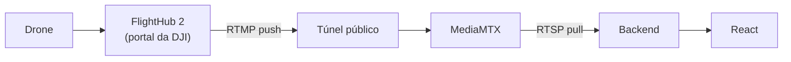
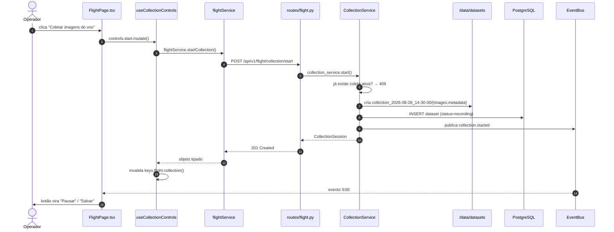
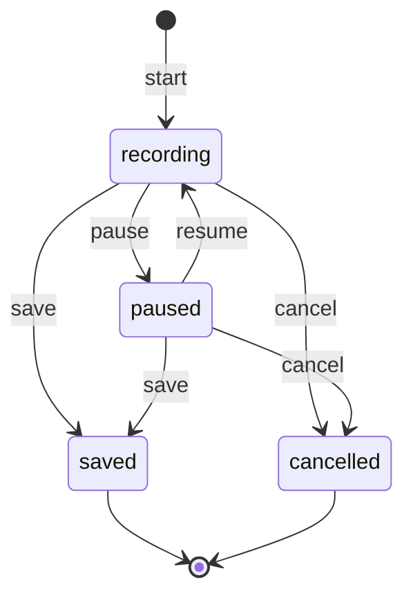

# Voo e coleta

## Como a conexão realmente funciona

O FlightHub 2 não expõe API de controle para este caso de uso. O que ele faz é
**publicar** o vídeo em um endereço RTMP que o operador cola no portal da DJI.
Tudo o que o backend controla é o lado receptor.



Duas consequências que costumam surpreender quem chega ao projeto:

1. **Resolução e bitrate não são configuráveis aqui.** Saem do encoder da
   aeronave e só mudam no portal da DJI. A interface mostra os valores; não
   oferece controle que não existe.
2. **O endereço do túnel muda a cada reinício.** Depois de colar o novo
   endereço no FlightHub, é preciso reeditar o canal de encaminhamento e
   desligar e religar o toggle — sem isso o drone continua publicando no
   endereço antigo. Esse aviso está na interface, na página Voo.

## Rastreabilidade — botão "Coletar Imagens do Voo"



| Elo | Arquivo |
| --- | --- |
| Componente | `frontend/src/pages/flight/FlightPage.tsx` |
| Hook | `frontend/src/hooks/useFlight.ts` → `useCollectionControls` |
| Service (front) | `frontend/src/services/api/flightService.ts` |
| Rota | `backend/app/api/v1/routes/flight.py` |
| Service (back) | `backend/app/services/collection_service.py` |
| Persistência | `backend/app/models/dataset.py` |

## Estrutura em disco

```text
/data/datasets/
└── collection_2026-08-26_14-30-00/
    ├── images/
    │   ├── frame_000000.jpg
    │   └── frame_000001.jpg
    ├── metadata/
    │   └── frames.jsonl
    └── collection.json
```

Cada frame carrega `captured_at` e `frame_number`. Os dois juntos permitem
reconstruir a ordem temporal exata mesmo se os arquivos forem copiados fora de
ordem — e é dessa ordem que o split temporal depende.

## Máquina de estados da coleta



As transições são validadas no **backend**. Desabilitar um botão na interface
é conveniência para o usuário, não segurança: uma segunda aba, um clique duplo
ou um `curl` chegam na mesma rota.

## Pipeline

Liga e desliga o consumo do stream pelo modelo. Este projeto **não executa** a
inferência — comanda o processo que a outra equipe entrega e reporta o estado.

Quando não há arquivo de pesos em `/data/models/best.pt`, a aplicação roda em
passthrough: o vídeo passa intacto e nada é detectado. A interface diz isso com
todas as letras em vez de mostrar um estado vazio ambíguo.

O estado hoje vive em memória (`PipelineService`). Ao rodar mais de uma réplica,
mover para uma tabela `pipeline_runs` — a interface pública da classe não muda.
