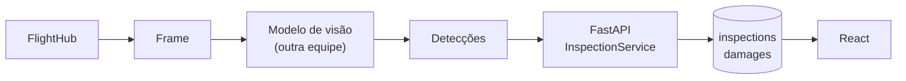

# Inspeções

Uma inspeção é o resultado do modelo de visão computacional sobre um voo. Este
projeto **não** produz esse resultado — ele o recebe, persiste e apresenta.

## Origem dos dados



## O que cada tela consome

| Elemento | Endpoint | Componente |
| --- | --- | --- |
| Evolução das inspeções | `GET /inspections/timeseries?metric=count` | `TimeSeriesChart` |
| Percentual com avarias | `GET /inspections/statistics` | `DamageRatioChart` |
| Tabela de inspeções | `GET /inspections` | `InspectionsPage` |
| Avarias por inspeção (Dashboard) | `GET /dashboard/damage-series` | `TimeSeriesChart` |

O mesmo componente de série temporal serve o Dashboard e a página de Inspeção.
Mesma leitura, mesmo eixo, mesma cor — o operador aprende a ler o gráfico uma
vez só.

## Percentual com avarias

O cálculo é feito no banco, em uma consulta, não no navegador:

```python
select(
    func.count(Inspection.id),
    func.sum(case((Inspection.damage_count > 0, 1), else_=0)),
)
```

Com 45 inspeções daria na mesma. Com 45 mil, calcular no cliente significa
transferir 45 mil linhas para exibir um número.

## Notas SAP

Uma inspeção com avarias pode gerar nota. O card **Notas Abertas** do Dashboard
conta `sap_notes` com `status = open`.

A abertura da nota ainda é manual. Quando houver integração com o SAP, ela
entra como uma nova pasta em `integrations/sap/` e um método no
`InspectionService` — sem mexer em rota nem em componente.
