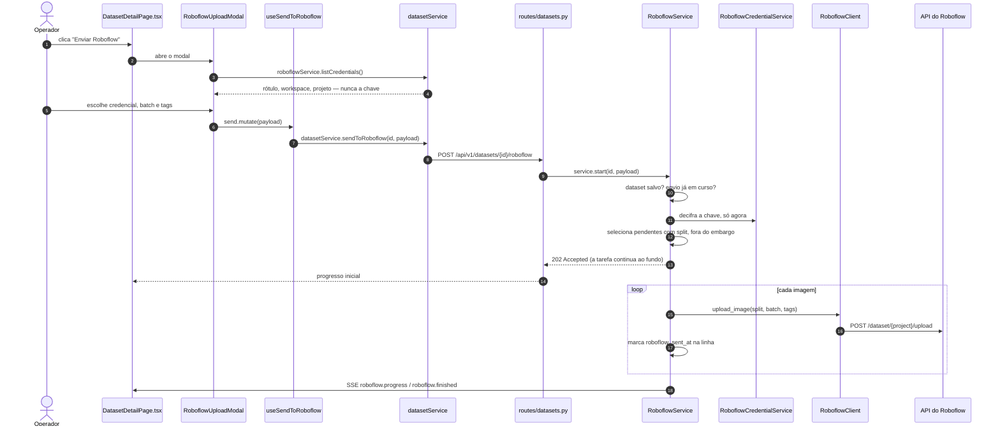

# Roboflow

O Roboflow é onde as imagens são anotadas antes do treino. Esta plataforma
grava o dataset, particiona e envia — a anotação e o treino são de outra equipe.

## Cadeia completa



## O envio não bloqueia a requisição

`POST /datasets/{id}/roboflow` valida, cria a tarefa e devolve `202` na hora. O
envio de 500 imagens leva minutos; segurar a resposta HTTP até o fim deixaria a
tela travada e o navegador desistiria por timeout muito antes.

A tarefa roda no próprio laço de eventos, não numa thread: cada imagem é I/O de
rede aguardável (`httpx.AsyncClient`), e uma thread só faria sentido com um
cliente síncrono — que é exatamente o motivo de o M4TD ter usado uma, já que o
pacote `roboflow` é síncrono e imprime na saída padrão. Falando o mesmo endereço
por HTTP, não há thread nem `redirect_stdout` para capturar saída de terceiro.

A sessão de banco é própria da tarefa: a da requisição fecha quando a resposta é
enviada.

O progresso chega por dois caminhos — evento SSE a cada 10 imagens (um por
imagem inundaria o canal) e `GET /datasets/{id}/roboflow`, que a tela consulta
enquanto o envio está ativo.

## O split vai junto

```python
for split in ("train", "valid", "test"):
    for img in sorted((base / split / "images").glob("*.jpg")):
        upload(img, split=split, batch=batch_name, tags=tags)
```

Cada imagem sobe com `split=train|valid|test`, já decidido pelo backend.

!!! danger "Sem o parâmetro `split`, o Roboflow reparticiona sozinho"
    E a divisão dele é **aleatória**. Isso desfaz inteiro o trabalho descrito em
    [Datasets](datasets.md): quadros vizinhos no tempo voltam a cair em
    partições diferentes e o vazamento de treino na validação está de volta —
    agora invisível, porque aconteceu do outro lado da rede.

**O frontend não divide dataset.** Ele dispara e acompanha. Essa regra está
tanto na revisão de código quanto na forma da API: não existe endpoint que
aceite uma partição vinda do cliente.

### Frames em embargo não são enviados

O filtro é explícito no service:

```python
select(DatasetImage).where(
    DatasetImage.dataset_id == dataset_id,
    DatasetImage.embargoed.is_(False),
    DatasetImage.split.is_not(None),
    DatasetImage.roboflow_sent_at.is_(None),
)
```

Enviá-los desfaria o embargo do outro lado.

### Batch e tags

Padrão: o `batch_name` é a versão do dataset, e as tags são a versão mais
`drone`. São a única resposta possível quando alguém perguntar, meses depois, de
qual voo veio determinada imagem.

## Falha parcial não aborta o lote

Uma imagem que falha é registrada na própria linha (`dataset_images.roboflow_error`)
e o lote continua. Cada sucesso marca `roboflow_sent_at`.

**É isso que permite retomar.** Subiram 300 de 500, o próximo envio começa da
301: `_pending()` filtra por `roboflow_sent_at IS NULL`, e o botão "enviar de
novo" é literalmente o mesmo endpoint.

Dez falhas seguidas param a execução. Nesse ponto o problema não é do arquivo —
chave errada, projeto inexistente, rede fora — e insistir 500 vezes só demora
mais. A mensagem final traz o último erro e diz que reenviar retoma de onde
parou.

Um lote incompleto fica com `roboflow_status = failed`, não `sent`. A distinção
importa: um dataset com 60% das imagens lá dentro tem que aparecer diferente de
um completo, senão alguém treina com o que faltou sem saber.

O envio pode ser cancelado; ele para depois da imagem atual, e o que já subiu
não sobe outra vez.

## Credenciais

O pedido era poder gravar a chave e, no acesso seguinte, escolher numa lista
suspensa. O que isso implica não é simples, e as regras abaixo não têm exceção.

```
GET    /api/v1/datasets/roboflow/credentials       lista (sem a chave)
POST   /api/v1/datasets/roboflow/credentials       grava nova
DELETE /api/v1/datasets/roboflow/credentials/{id}
```

| Regra | Como |
| --- | --- |
| Cifrada em repouso | `cryptography.fernet`, chave derivada de `SECRET_KEY` por SHA-256 |
| Nunca volta pela API | `RoboflowCredentialOut` não tem campo de chave — nem mascarado |
| Nunca em log | o logger do `httpx` é silenciado abaixo de WARNING |
| Nunca em erro | tudo que veio de exceção passa por `scrub()` antes de ser gravado |
| No formulário | campo `type="password"`, `autocomplete="off"` |
| Sem `SECRET_KEY` | a aplicação **não grava** e explica o motivo na tela |

### Por que não mascarar

Chave mascarada continua sendo vazamento parcial, e a máscara só ajuda quem já
tem o resto. `RoboflowCredentialOut` devolve `id`, `label`, `workspace`,
`project` e `last_used_at` — mais nada. O texto claro existe em memória por dois
instantes: quando a credencial é gravada e quando um upload a decifra para
montar a requisição.

### Por que não há chave padrão

Sem `SECRET_KEY` definida, gravar é recusado com `SECRET_KEY_MISSING` e a tela
diz o que fazer. Inventar um segredo efêmero produziria um banco que não reabre
no reinício seguinte; gravar em claro é pior ainda.

Trocar o `SECRET_KEY` depois de gravar torna as credenciais existentes
indecifráveis, e o erro diz isso em palavras — a alternativa é o operador achar
que o banco corrompeu e passar a tarde investigando.

### A chave viaja na query string

A API do Roboflow exige `?api_key=`. Isso tem uma consequência que só aparece em
produção: **o `httpx` registra a URL completa de cada requisição em nível INFO**.
Um lote de 500 imagens escrevia a chave 500 vezes no log — exatamente onde ela
não pode estar.

Duas defesas, porque uma só depende de biblioteca de terceiro se comportar:

1. `configure_logging()` põe os loggers `httpx` e `httpcore` em WARNING.
2. `scrub()` troca `api_key=...` por `api_key=***` em qualquer texto que tenha
   vindo de uma exceção, antes de ele ir para o banco, para a tela ou para o log.

A cobertura está em `tests/test_secrets.py`.

## A cadeia, arquivo por arquivo

| Passo | Arquivo |
| --- | --- |
| Botão e progresso | `pages/datasets/DatasetDetailPage.tsx` |
| Modal de credencial, batch e tags | `components/datasets/RoboflowUploadModal.tsx` |
| Hooks e invalidação | `hooks/useDatasets.ts` |
| Chamadas do envio | `services/api/datasetService.ts` |
| Chamadas das credenciais | `services/api/roboflowService.ts` |
| Rotas | `api/v1/routes/datasets.py` |
| Orquestração, retomada, cancelamento | `services/roboflow_service.py` |
| Cifragem e decifragem | `services/roboflow_credentials_service.py`, `core/crypto.py` |
| HTTP do Roboflow, `scrub` | `integrations/roboflow/client.py` |

## Endpoints do envio

```
POST   /api/v1/datasets/{id}/roboflow          dispara (202) e volta na hora
GET    /api/v1/datasets/{id}/roboflow          progresso
POST   /api/v1/datasets/{id}/roboflow/cancel   para depois da imagem atual
```
