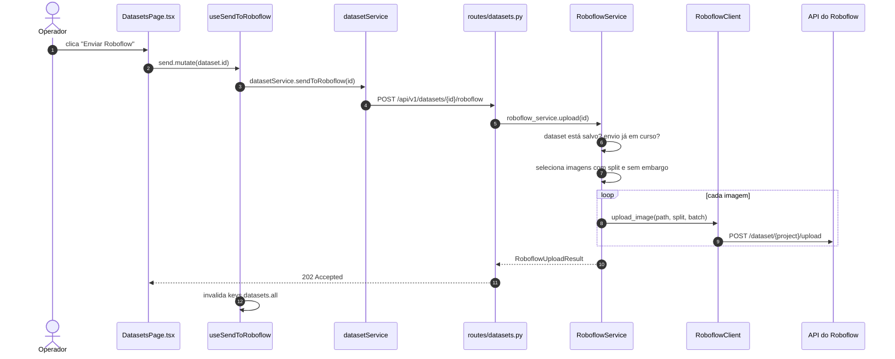

# Roboflow

## Cadeia completa



## O split vai junto

Cada imagem é enviada com `split=train|valid|test`, já decidido pelo backend.
O Roboflow respeita esse rótulo em vez de refazer a própria divisão — que seria
aleatória e desfaria todo o cuidado descrito em [Datasets](datasets.md).

**O frontend não divide dataset.** Ele dispara e acompanha. Essa regra está
tanto na revisão de código quanto na forma da API: não existe endpoint que
aceite uma partição vinda do cliente.

## Frames em embargo não são enviados

O filtro é explícito no service:

```python
select(DatasetImage).where(
    DatasetImage.dataset_id == dataset_id,
    DatasetImage.embargoed.is_(False),
)
```

Enviá-los desfaria o embargo do outro lado.

## Falha parcial

Uma imagem que falha não aborta o lote. O contador de falhas sobe, o log
registra qual arquivo foi, e ao final o dataset fica com `roboflow_status =
failed` e uma mensagem com o total. Melhor 1.840 imagens enviadas e 2 anotadas
como pendentes do que uma operação de 20 minutos perdida no frame 1.839.

## Configuração

```bash
ROBOFLOW_API_KEY=
ROBOFLOW_WORKSPACE=
ROBOFLOW_PROJECT=
```

Sem essas três variáveis, o endpoint devolve `400 ROBOFLOW_NOT_CONFIGURED` com
uma mensagem que diz o que falta. Nunca commite valores reais — ver
[Desenvolvimento](development.md#segredos).
