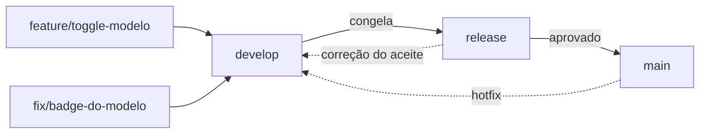

# Fluxo de branches

Três branches de vida longa, cada uma com um papel que não se mistura.

| Branch | O que é | Quem escreve nela |
| --- | --- | --- |
| `main` | **o que roda em produção** | só `release`, por merge |
| `release` | preparação: congelamento, teste de aceite, correção pontual | `develop`, e correções feitas ali mesmo |
| `develop` | integração contínua das features | as branches de trabalho |



A seta pontilhada de volta importa: **correção feita em `release` volta para
`develop`**. Sem isso, o bug corrigido para o aceite reaparece na próxima
feature, e ninguém entende como.

---

## O caminho de um peso novo até produção

O caso concreto, porque é o mais frequente e o que mais confunde: **o peso não
percorre esse caminho.** O notebook percorre.

```
treina no notebook → copia best.pt para models/ → confere na tela Voo
                                                        │
                                          commit e push DO NOTEBOOK
                                                        │
                                            develop → release → main
```

O `best.pt` está no `.gitignore` e não entra em branch nenhuma. O que é
versionado é o notebook que o produziu — texto, com diff legível. Ver
[Onde colocar o peso do modelo](../modelo/index.md#por-que-os-pesos-nao-vao-para-o-git).

Isso tem uma consequência prática que vale dizer em voz alta: **promover
`develop` para `main` não entrega um modelo novo.** O peso é entregue copiando
o arquivo para a `models/` da máquina onde a aplicação roda — em produção,
inclusive. O merge entrega o *código*; a cópia entrega o *modelo*. São dois
movimentos independentes de propósito, e é por isso que trocar o modelo não
exige deploy.

---

## O que cada branch dispara

| Evento | O que roda |
| --- | --- |
| push em qualquer branch | `pytest -q`, `npm run lint`, `tsc --noEmit`, `npm test` |
| merge em `develop` | o mesmo, mais o build do frontend |
| merge em `release` | o mesmo, mais `mkdocs build --strict` |
| merge em `main` | publicação da documentação e implantação |

Os comandos são exatamente os que você roda localmente — não há verificação que
só exista no servidor:

```bash
# 🐳 CONTAINER
cd backend  && pytest -q
cd frontend && npm run lint && npx tsc --noEmit && npm test
```

---

## Nomes de branch de trabalho

```
feature/<assunto-curto>      funcionalidade nova
fix/<assunto-curto>          correção
docs/<assunto-curto>         só documentação
chore/<assunto-curto>        dependência, configuração, ferramenta
```

Saem de `develop` e voltam para `develop`. Uma exceção: **hotfix de produção**
sai de `main`, entra em `main` e é imediatamente levado para `develop` também —
senão o próximo merge de `release` desfaz a correção.

---

## Migrations

Migration é código: **commite junto com a mudança do modelo**, na mesma branch e
no mesmo commit. Uma migration que chega depois deixa `develop` num estado em
que o teste passa na máquina de quem escreveu e falha em todas as outras.

```bash
# 🐳 CONTAINER, em backend/
alembic revision --autogenerate -m "descrição"
alembic upgrade head
```

Duas branches que geram migration em paralelo produzem duas cabeças no Alembic.
Quem faz o segundo merge conserta, apontando o `down_revision` da sua para a
outra — não gerando uma terceira.
